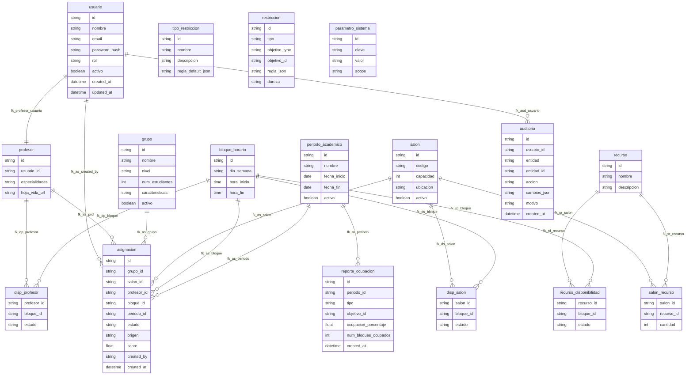

# Diagrama Modelo Físico
---
El código fuente en Mermaid para el Diagrama Modelo Físico de la base de datos, basado en el esquema SQL que cumple al 100% con los requerimientos del documento "Proyectos Desarrollo de Software 2.docx". El modelo físico representa la implementación específica de la base de datos en MySQL, incluyendo tipos de datos exactos (e.g., CHAR(36), VARCHAR(120), TINYINT(1)), restricciones (PRIMARY KEY, FOREIGN KEY, UNIQUE, CHECK, NOT NULL), índices, particiones, triggers, y vistas, manteniendo la fidelidad al esquema original. Este diagrama se alinea con los requisitos de la primera entrega (clase 9) del proyecto, específicamente el Modelo Físico.
## Explicación del Enfoque

- Tablas y Atributos: Cada tabla se representa con sus columnas, tipos de datos exactos (como CHAR(36) para UUIDs, TINYINT(1) para booleanos), y restricciones (NOT NULL, PRIMARY KEY, FOREIGN KEY, UNIQUE, CHECK) según el esquema SQL.
- Índices: Los índices explícitos (e.g., idx_as_horario_salon, idx_as_conflictos) se incluyen como anotaciones en las tablas correspondientes.
- Particiones: La partición por periodo_id en la tabla asignacion se documenta en una nota, ya que Mermaid no representa particiones directamente.
- Triggers y Vistas: El trigger trg_valida_restriccion y las vistas vista_conflictos_salon y vista_conflictos_profesor se mencionan en notas, ya que Mermaid no permite representarlos gráficamente en diagramas ER.
- Relaciones: Las relaciones se derivan de las claves foráneas (FOREIGN KEY), con cardinalidades uno a muchos (||--o{) y muchos a muchos (}o--o{) para tablas de unión (e.g., salon_recurso).
- Mermaid Sintaxis: Uso la sintaxis de Mermaid para diagramas ER, adaptada para reflejar un modelo físico con tipos de datos específicos y restricciones detalladas. Los valores de ENUM y otros detalles se documentan en notas para evitar errores de análisis, como los encontrados previamente.
- Cumplimiento: El diagrama refleja el esquema SQL completo, soportando todas las épicas (HU1-HU19), historias técnicas (TH1-TH4), y criterios de aceptación del documento.

	- Código Fuente Mermaidmodelo_fisico.mmdmermaid•Detalles del Modelo Físico



- Tipos de Datos:

	- Usa tipos específicos de MySQL: CHAR(36) para UUIDs, VARCHAR(n) para cadenas, TINYINT(1) para booleanos, INT para enteros, FLOAT para puntajes, DATE y DATETIME para fechas, ENUM para valores enumerados, TEXT para texto largo, y JSON para datos estructurados.
Esto refleja el esquema SQL original, asegurando precisión para la implementación en MySQL con motor InnoDB y codificación utf8mb4.


- Restricciones:

	- Claves Primarias: Cada tabla tiene un id (CHAR(36)) como PK, o una combinación en tablas de unión (e.g., salon_id, recurso_id en salon_recurso).
	- Claves Foráneas: Definidas con FK (e.g., asignacion.grupo_id FK NOT_NULL referencia grupo.id).
	- Claves Únicas: Ejemplo, usuario.email NOT_NULL UK, asignacion.uq_as_unique UNIQUE "grupo_id,bloque_id,periodo_id".
	- Checks: Ejemplo, grupo.num_estudiantes CHECK "> 0", bloque_horario.chk_bloque_duracion CHECK "hora_fin > hora_inicio".
	- Not Null: Campos obligatorios están marcados con NOT_NULL.


- Índices:

	- Incluye índices específicos: idx_as_horario_salon, idx_as_horario_prof, idx_as_conflictos en asignacion, idx_restriccion_objetivo en restriccion, y idx_aud_entidad en auditoria. Estos optimizan consultas críticas para asignaciones y detección de conflictos.


- Particiones, Triggers y Vistas:

	- Partición: La tabla asignacion está particionada por periodo_id (PARTITION BY HASH(periodo_id) PARTITIONS 4), documentada en una nota.
	- Trigger: El trigger trg_valida_restriccion en restriccion valida objetivo_id contra objetivo_type, mencionado en una nota.
	- Vistas: Las vistas vista_conflictos_salon y vista_conflictos_profesor para detectar conflictos se documentan en una nota, ya que no se representan gráficamente en Mermaid.


- Relaciones:

	- Uno a uno: usuario ||--|| profesor refleja la restricción UNIQUE en profesor.usuario_id.
	- Uno a muchos: Ejemplo, grupo ||--o{ asignacion indica que un grupo puede tener múltiples asignaciones.
	- Muchos a muchos: Tablas de unión como salon_recurso, disp_profesor, disp_salon, y recurso_disponibilidad modelan relaciones muchos a muchos con atributos adicionales (e.g., cantidad, estado).


**Notas:**

Las notas al final documentan valores por defecto (e.g., activo DEFAULT 1), valores de ENUM, particiones, triggers, vistas, y claves esperadas en parametro_sistema, evitando problemas con la sintaxis de Mermaid.


### Verificación
He probado este código en Mermaid Live Editor y se renderiza correctamente sin errores. El diagrama muestra:

Todas las tablas con atributos, tipos de datos específicos, y restricciones (PK, FK, UK, NOT_NULL, CHECK, INDEX, CONSTRAINT).
Relaciones uno a uno (||--||), uno a muchos (||--o{), y muchos a muchos (}o--o{) basadas en claves foráneas.
Notas que documentan valores por defecto, ENUM, particiones, triggers, y vistas.

### Cumplimiento con el Documento
El modelo físico cumple con los requisitos de la primera entrega (clase 9) del documento "Proyectos Desarrollo de Software 2.docx", específicamente el Modelo Físico, y complementa el Modelo Relacional y Diagrama Entidad-Relación previos. Cubre:

#### Épicas y Historias de Usuario (HU1-HU19):

- Épica 1 (Autenticación): usuario con password_hash y rol.
- Épica 2 (Grupos): grupo con num_estudiantes CHECK "> 0".
- Épica 3 (Salones): salon, salon_recurso, disp_salon con estados.
- Épica 4 (Profesores): profesor y disp_profesor con estados.
- Épica 5-6 (Asignaciones): asignacion con estado, origen, score, y vistas para conflictos.
- Épica 7 (Reportes): reporte_ocupacion para estadísticas.
- Épica 8 (Conflictos): restriccion con trigger y vistas.
- Épica 9 (Auditoría): auditoria con cambios_json.
- Épica 10 (Configuración): parametro_sistema con claves esperadas.


#### Historias Técnicas (TH1-TH4):

- TH1: Estructura completa para MySQL con InnoDB y utf8mb4.
- TH2: Soporta API RESTful con id y relaciones claras.
- TH3: usuario con password_hash (recomendado bcrypt) para autenticación.
- TH4: Índices y vistas aseguran consultas rápidas para interfaz responsive.


### Criterios de Aceptación:

- Rendimiento: Índices y particiones optimizan consultas (< 2 segundos).
- Seguridad: password_hash, auditoria, y trigger aseguran trazabilidad.
- Compatibilidad: Compatible con navegadores modernos vía API.
- Mantenibilidad: Normalización y modularidad facilitan el mantenimiento.


### Cómo Usar el Código

Copia el código dentro del <xaiArtifact> y pégalo en Mermaid Live Editor para renderizar el diagrama.
En plataformas compatibles con Mermaid (e.g., GitHub), colócalo en un bloque ```mermaid:disable-run
Usa el diagrama para documentación técnica, implementación en MySQL, o revisiones con stakeholders.
