# Diagrama Modelo Relaciona
---
El código fuente en Mermaid para el Modelo Relacional correspondiente al esquema de la base de datos actualizada, que cumple al 100% con los requerimientos del documento "Proyectos Desarrollo de Software 2.docx". Este modelo relacional refleja las tablas, sus atributos, tipos de datos, restricciones (claves primarias, foráneas, únicas, y de verificación), y las relaciones entre ellas, basándose en el esquema SQL proporcionado. El diagrama está diseñado para ser claro, preciso y alineado con los requisitos de la primera entrega del proyecto (clase 9), específicamente el Modelo Relacional.
## Explicación del Enfoque

- Tablas y Atributos: Cada tabla se representa con sus columnas, incluyendo tipos de datos y restricciones como claves primarias (PK), claves foráneas (FK), claves únicas (UK), y verificaciones (CHECK). Los tipos de datos se mantienen fieles al esquema SQL (e.g., CHAR(36), VARCHAR, ENUM, etc.).
- Relaciones: Las claves foráneas definen las relaciones entre tablas, representadas con líneas que indican cardinalidades (e.g., uno a muchos, muchos a muchos). Las tablas de unión (e.g., salon_recurso, disp_profesor) se incluyen explícitamente como relaciones muchos a muchos.
- Restricciones: Se destacan las restricciones de integridad (FOREIGN KEY, UNIQUE, CHECK) en los atributos y relaciones. Los triggers (e.g., trg_valida_restriccion) no se representan gráficamente, pero se mencionan en comentarios para contexto.
- Mermaid: Uso la sintaxis de Mermaid para diagramas ER, adaptada para enfatizar el modelo relacional, incluyendo tipos de datos y restricciones. Esto es compatible con herramientas como Mermaid Live Editor.
- Organización: Las tablas están agrupadas lógicamente para reflejar las épicas (gestión de usuarios, grupos, salones, asignaciones, etc.), y las relaciones se dibujan para minimizar cruces y mejorar la legibilidad.

	- Código Fuente Mermaidmodelo_relacional.mmdmermaid•Explicación del Modelo Relacional

```mermaid
erDiagram
    periodo_academico {
        string id PK
        string nombre
        date   fecha_inicio
        date   fecha_fin
        boolean activo
    }

    bloque_horario {
        string id PK
        string dia_semana "Lunes|Martes|Miercoles|Jueves|Viernes|Sabado|Domingo"
        time   hora_inicio
        time   hora_fin
        string chk_bloque_duracion "Regla: hora_fin > hora_inicio"
    }

    usuario {
        string   id PK
        string   nombre
        string   email UK
        string   password_hash
        string   rol "ADMIN|COORDINADOR|PROFESOR|coord_INFRA"
        boolean  activo
        datetime created_at
        datetime updated_at
    }

    profesor {
        string id PK
        string usuario_id FK "usuario.id (UNIQUE → relación 1:1)"
        string especialidades
        string hoja_vida_url
    }

    grupo {
        string id PK
        string nombre
        string nivel
        int    num_estudiantes "> 0"
        string caracteristicas
        boolean activo
    }

    salon {
        string id PK
        string codigo UK
        int    capacidad "> 0"
        string ubicacion
        boolean activo
    }

    recurso {
        string id PK
        string nombre
        string descripcion
    }

    salon_recurso {
        string salon_id   PK "FK salon.id"
        string recurso_id PK "FK recurso.id"
        int    cantidad ">= 0"
    }

    recurso_disponibilidad {
        string recurso_id PK "FK recurso.id"
        string bloque_id  PK "FK bloque_horario.id"
        string estado "Disponible|NoDisponible|Reservado"
    }

    disp_profesor {
        string profesor_id PK "FK profesor.id"
        string bloque_id   PK "FK bloque_horario.id"
        string estado "Disponible|NoDisponible|Preferido|Licencia"
    }

    disp_salon {
        string salon_id  PK "FK salon.id"
        string bloque_id PK "FK bloque_horario.id"
        string estado "Disponible|NoDisponible|Reservado|Mantenimiento"
    }

    asignacion {
        string   id PK
        string   grupo_id    FK "grupo.id"
        string   salon_id    FK "salon.id"
        string   profesor_id FK "profesor.id"
        string   bloque_id   FK "bloque_horario.id"
        string   periodo_id  FK "periodo_academico.id"
        string   estado "Propuesta|Confirmada|Anulada"
        string   origen "Manual|Automatica"
        float    score
        string   created_by  FK "usuario.id"
        datetime created_at
        string   uq_as_unique "UNIQUE (grupo_id,bloque_id,periodo_id)"
        string   idx_as_horario_salon "INDEX (periodo_id,bloque_id,salon_id)"
        string   idx_as_horario_prof  "INDEX (periodo_id,bloque_id,profesor_id)"
        string   idx_as_conflictos    "INDEX (periodo_id,bloque_id,salon_id,profesor_id)"
    }

    tipo_restriccion {
        string id PK
        string nombre UK
        string descripcion
        string regla_default_json "JSON"
    }

    restriccion {
        string id PK
        string tipo
        string objetivo_type
        string objetivo_id
        string regla_json "JSON"
        string dureza "Blando|Duro"
        string idx_restriccion_objetivo "INDEX (objetivo_type,objetivo_id)"
        string nota_trigger "Trigger: valida objetivo_id según objetivo_type"
    }

    auditoria {
        string   id PK
        string   usuario_id FK "usuario.id"
        string   entidad
        string   entidad_id
        string   accion
        string   cambios_json "JSON"
        string   motivo
        datetime created_at
        string   idx_aud_entidad "INDEX (entidad,entidad_id)"
    }

    reporte_ocupacion {
        string   id PK
        string   periodo_id FK "periodo_academico.id"
        string   tipo "Salon|Profesor"
        string   objetivo_id
        float    ocupacion_porcentaje
        int      num_bloques_ocupados
        datetime created_at
        string   uq_ro_unique "UNIQUE (periodo_id,tipo,objetivo_id)"
    }

    parametro_sistema {
        string id PK
        string clave UK
        string valor "JSON"
        string scope
        string comentario "Claves: periodo_academico|horas_laborables|dias_laborables"
    }

    %% Relaciones (cardinalidades)
    usuario ||--|| profesor : fk_profesor_usuario
    usuario ||--o{ asignacion : fk_as_created_by
    usuario ||--o{ auditoria  : fk_aud_usuario

    profesor ||--o{ disp_profesor : fk_dp_profesor
    profesor ||--o{ asignacion    : fk_as_prof

    grupo   ||--o{ asignacion : fk_as_grupo

    salon   ||--o{ salon_recurso : fk_sr_salon
    salon   ||--o{ disp_salon    : fk_ds_salon
    salon   ||--o{ asignacion    : fk_as_salon

    recurso ||--o{ salon_recurso         : fk_sr_recurso
    recurso ||--o{ recurso_disponibilidad : fk_rd_recurso

    bloque_horario ||--o{ disp_profesor          : fk_dp_bloque
    bloque_horario ||--o{ disp_salon             : fk_ds_bloque
    bloque_horario ||--o{ recurso_disponibilidad : fk_rd_bloque
    bloque_horario ||--o{ asignacion             : fk_as_bloque

    periodo_academico ||--o{ asignacion       : fk_as_periodo
    periodo_academico ||--o{ reporte_ocupacion : fk_ro_periodo
```



- **Tablas y Atributos:**

Cada entidad corresponde a una tabla del esquema SQL, con tipos de datos exactos (e.g., CHAR(36), VARCHAR(120), ENUM) y restricciones (NOT_NULL, PK, FK, UK, CHECK).
Se incluyen índices (e.g., idx_as_horario_salon) y comentarios (e.g., para restriccion sobre el trigger) para reflejar optimizaciones y validaciones.
Los valores por defecto (e.g., activo DEFAULT 1) y restricciones como CHECK (num_estudiantes > 0) se especifican para claridad.


- **Relaciones:**

Uno a muchos: Ejemplo, usuario ||--o{ profesor indica que un usuario puede estar asociado a un profesor (vía usuario_id), pero un profesor solo tiene un usuario. Similar para periodo_academico ||--o{ asignacion.
Muchos a muchos: Tablas como salon_recurso, disp_profesor, disp_salon, y recurso_disponibilidad modelan relaciones muchos a muchos, con atributos adicionales (e.g., cantidad, estado).
Las claves foráneas se nombran explícitamente (e.g., fk_profesor_usuario, fk_as_grupo) para reflejar las restricciones del esquema SQL.


- **Restricciones:**

Claves primarias: Cada tabla tiene un id (o combinación en tablas de unión) como PK.
Claves foráneas: Ejemplo, asignacion.grupo_id referencia grupo.id, asegurando integridad referencial.
Claves únicas: Ejemplo, usuario.email y asignacion(grupo_id, bloque_id, periodo_id) tienen restricciones UNIQUE.
Checks: Ejemplo, bloque_horario.chk_bloque_duracion asegura que hora_fin > hora_inicio.


- **Notación Mermaid:**

PK, FK, UK: Clave primaria, foránea, y única.
NOT_NULL: Campo obligatorio.
CHECK: Restricciones de verificación (e.g., > 0 para num_estudiantes).
DEFAULT: Valor por defecto (e.g., Propuesta en asignacion.estado).
||--o{: Relación uno a muchos.
}o--o{: Relación muchos a muchos.


	- Vistas y Triggers: No se representan gráficamente (Mermaid ERD se centra en tablas y relaciones), pero el comentario en restriccion menciona el trigger trg_valida_restriccion para validar objetivo_id.

### Cumplimiento con el Documento
El modelo relacional cumple con los requisitos de la primera entrega (clase 9) del documento, específicamente el Modelo Relacional y el Diagrama Entidad-Relación (complementado por el ERD previo). 
- Cubre:

	- Épicas y Historias de Usuario (HU1-HU19): Cada tabla soporta una funcionalidad específica (e.g., usuario para HU1-HU2, asignacion para HU9-HU12, reporte_ocupacion para HU15).
	- Historias Técnicas (TH1-TH4): La estructura relacional soporta la configuración de la base de datos (TH1), API RESTful (TH2), autenticación (TH3), e interfaz responsive (TH4).
	- Criterios de Aceptación: La normalización, índices, y particionamiento aseguran respuestas rápidas (< 2 segundos), compatibilidad con navegadores modernos, y seguridad (e.g., password_hash).
	- Mantenibilidad y Modularidad: La estructura normalizada (tercera forma normal en la mayoría de las tablas) y las relaciones claras facilitan el mantenimiento y la extensibilidad.

### Cómo Usar el Código

Copia el código dentro del <xaiArtifact> y pégalo en Mermaid Live Editor para renderizar el diagrama.
En plataformas compatibles con Mermaid (e.g., GitHub), el código puede renderizarse directamente en un bloque ```mermaid:disable-run
El diagrama es ideal para documentación técnica, presentaciones, o revisión con stakeholders.