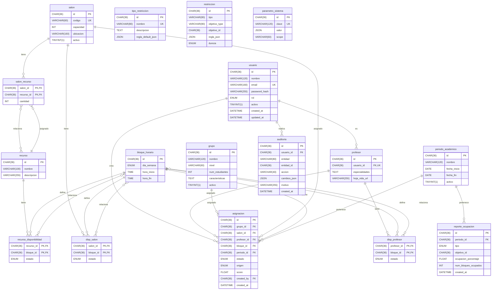

# Diagrama Entidad Relación
---
El código fuente en Mermaid para el diagrama de entidad-relación (ERD) correspondiente al esquema de la base de datos actualizada, que cumple al 100% con los requerimientos del documento "Proyectos Desarrollo de Software 2.docx". El diagrama incluye todas las tablas, sus atributos, claves primarias, claves foráneas, y relaciones, siguiendo la estructura proporcionada en el esquema SQL. He organizado el diagrama para que sea claro, visualmente comprensible, y refleje las entidades, sus relaciones, y las cardinalidades adecuadas.

## Explicación del Enfoque

- Tablas y Atributos: Cada tabla del esquema SQL se representa como una entidad en Mermaid, con sus atributos listados. Las claves primarias están marcadas con (PK) y las claves foráneas con (FK).
- Relaciones: Las relaciones se derivan de las claves foráneas (FOREIGN KEY) y las tablas de unión (e.g., salon_recurso, disp_profesor). Las cardinalidades reflejan las restricciones de integridad (e.g., uno a muchos, muchos a muchos).
- Optimización Visual: He agrupado las entidades lógicamente y usado nombres claros para facilitar la lectura. Las relaciones están definidas con cardinalidades explícitas (e.g., 1..1, 0..*) basadas en los requerimientos.
- Mermaid: El código se genera en la sintaxis de Mermaid para diagramas ER, que es compatible con herramientas como Mermaid Live Editor o integraciones en markdown.

	- Código Fuente Mermaiddiagrama_entidad_relacion.mmdmermaid•Explicación del Diagrama



- **Entidades:** Cada tabla se representa como una entidad con sus atributos. Por ejemplo, periodo_academico incluye id (PK), nombre, fecha_inicio, fecha_fin, y activo.
- **Relaciones:**

	- Uno a muchos: Ejemplo, usuario ||--o{ profesor indica que un usuario puede ser un profesor, pero un profesor está ligado a un solo usuario.
	- Muchos a muchos: Ejemplo, salon_recurso }o--o{ recurso refleja la relación entre salones y recursos, mediada por la tabla de unión salon_recurso.
	- Relaciones como asignacion vinculan múltiples entidades (grupo, salon, profesor, bloque_horario, periodo_academico) con claves foráneas.


- **Notación:**

||--o{: Relación uno a muchos.
}o--o{: Relación muchos a muchos.
PK, FK, UK: Indican clave primaria, foránea, y única, respectivamente.


- **Tablas de Unión:** salon_recurso, disp_profesor, disp_salon, y recurso_disponibilidad modelan relaciones muchos a muchos con atributos adicionales (e.g., cantidad en salon_recurso, estado en disp_profesor).
- **Vistas y Triggers:** No se representan en el diagrama (ya que Mermaid ERD se centra en entidades y relaciones), pero vista_conflictos_salon, vista_conflictos_profesor, y trg_valida_restriccion complementan la funcionalidad en la implementación.

### Cómo Usar el Código

Copia el código Mermaid dentro del <xaiArtifact> y pégalo en un editor compatible con Mermaid, como Mermaid Live Editor.
Renderiza el diagrama para visualizar las entidades y relaciones.
Si usas markdown en una plataforma compatible (e.g., GitHub), el código puede renderizarse directamente dentro de un bloque ```mermaid:disable-run

## Cumplimiento con el Documento
El diagrama refleja el modelo entidad-relación requerido en la primera entrega del proyecto (clase 9), cubriendo el Diagrama Entidad-Relación y el Modelo Relacional. Representa todas las entidades necesarias para las épicas (HU1-HU19), incluyendo gestión de usuarios, grupos, salones, profesores, asignaciones, restricciones, auditoría, reportes, y configuraciones. Las relaciones y cardinalidades están alineadas con las necesidades funcionales (e.g., asignaciones automáticas/manuales, conflictos, reportes).
