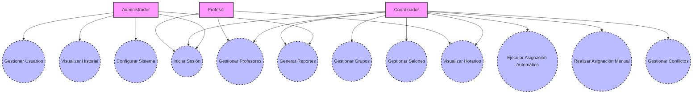

# Diagrama de Casos de Uso General

El Diagrama de Casos de Uso representa los actores del sistema y los casos de uso principales, derivados de las épicas y historias de usuario (HU1-HU19) del documento. Los actores incluyen roles como Administrador, Coordinador, Profesor, y Coordinador de Infraestructura (integrado en Coordinador para simplicidad, ya que comparte funcionalidades en HU5-HU6). Los casos de uso cubren las funcionalidades clave: autenticación, gestión de recursos, asignaciones, reportes, conflictos, auditoría, y configuración.
Para compatibilidad con herramientas como Mermaid Live Editor, he utilizado la sintaxis graph TD para simular el diagrama de casos de uso (ya que la sintaxis usecaseDiagram es beta y no siempre compatible). Actores se representan como rectángulos ([Actor]), casos de uso como óvalos ((Caso de Uso)), y asociaciones como líneas.

diagrama_casos_de_uso.mmdmermaid

---

## Diagrama General Casos de Uso

---

## Descripciones de Casos de Uso
A continuación, detallo los Casos de Uso principales, basados en las épicas y historias de usuario (HU) del backlog del producto. Cada caso de uso incluye: nombre, actor(es), descripción, precondiciones, postcondiciones, flujo principal, flujos alternativos, y referencias a la base de datos (tablas relevantes). Esto cumple con los requisitos de la primera entrega (clase 9) del documento, enfocándose en el análisis y diseño, y alineado con la base de datos (e.g., tablas como usuario, asignacion, restriccion para soportar las operaciones).

- **Caso de Uso: Iniciar Sesión (HU2)**
**Actor:** Administrador, Coordinador, Profesor.
**Descripción:** El usuario ingresa sus credenciales para acceder al sistema según su rol.
**Precondiciones:** El usuario tiene una cuenta registrada en el sistema.
**Postcondiciones:** El usuario está autenticado y redirigido a su interfaz según rol; se registra en auditoría.
-- **Flujo Principal:**
El usuario ingresa email y contraseña.
El sistema valida las credenciales contra usuario (comparando password_hash).
Si válido, se inicia sesión y se registra en auditoria.
Se muestra interfaz basada en rol.
-- **Flujos Alternativos:**
**Credenciales inválidas:** Mostrar error y registrar intento en auditoria.
**Referencias a BD:** Tablas usuario (para autenticación), auditoria (para registro).
**Excepciones:** Cuenta inactiva (activo = 0).

- **Caso de Uso: Gestionar Usuarios (HU1)**
**Actor:** Administrador.
**Descripción:** Crear, editar, desactivar o visualizar cuentas de usuarios con roles.
**Precondiciones:** Administrador autenticado.
**Postcondiciones:** Cuenta actualizada o creada; cambios registrados en auditoría.
-- **Flujo Principal:**
Administrador selecciona operación (crear/editar/desactivar).
Ingresa datos (nombre, email, rol, contraseña).
Sistema valida y guarda en usuario (hashing contraseña).
Registra cambio en auditoria.
-- **Flujos Alternativos:**
**Email duplicado:** Error (por UNIQUE en email).
**Referencias a BD:** Tabla usuario (para CRUD), auditoria (para registro).
**Excepciones:** Rol inválido (fuera de ENUM).

- **Caso de Uso: Gestionar Grupos (HU3, HU4)**
**Actor:** Coordinador.
**Descripción:** Registrar, editar, desactivar o visualizar grupos de estudiantes.
**Precondiciones:** Coordinador autenticado.
**Postcondiciones:** Grupo actualizado; cambios en auditoría.
-- **Flujo Principal:**
Coordinador ingresa datos (nombre, nivel, num_estudiantes, características).
Sistema valida (num_estudiantes > 0) y guarda en grupo.
Registra cambio en auditoria.
-- **Flujos Alternativos:**
**Desactivar grupo:** Set activo = 0.
**Referencias a BD:** Tabla grupo (para CRUD), auditoria.
**Excepciones:** Número de estudiantes inválido.

- **Caso de Uso: Gestionar Salones (HU5, HU6)**
**Actor:** Coordinador (o Coordinador de Infraestructura).
**Descripción:** Registrar salones con capacidad, recursos y disponibilidad.
**Precondiciones:** Coordinador autenticado.
**Postcondiciones:** Salón y recursos actualizados; cambios en auditoría.
-- **Flujo Principal:**
Coordinador ingresa datos (código, capacidad, ubicación, recursos).
Sistema valida (capacidad > 0) y guarda en salon, salon_recurso, disp_salon.
Registra cambio en auditoria.
-- **Flujos Alternativos:**
**Gestionar disponibilidad:** Actualizar disp_salon con bloque_horario.
**Referencias a BD:** Tablas salon, recurso, salon_recurso, disp_salon, bloque_horario, auditoria.
**Excepciones:** Código duplicado (UNIQUE en codigo).

- **Caso de Uso: Gestionar Profesores (HU7, HU8)**
**Actor:** Coordinador, Profesor (para disponibilidad propia).
**Descripción:** Registrar profesores con especialidades, hoja de vida y disponibilidad.
**Precondiciones:** Actor autenticado.
**Postcondiciones:** Profesor y disponibilidad actualizados; cambios en auditoría.
-- **Flujo Principal:**
Coordinador ingresa datos (especialidades, hoja_vida_url).
Sistema guarda en profesor, vinculando a usuario.
Profesor/Coordinador actualiza disponibilidad en disp_profesor con bloque_horario.
Registra cambio en auditoria
-- **Flujos Alternativos:**
Profesor actualiza disponibilidad propia.
**Referencias a BD:** Tablas profesor, usuario, disp_profesor, bloque_horario, auditoria.
**Excepciones:** Usuario no asociado a profesor.

- **Caso de Uso: Ejecutar Asignación Automática (HU9, HU10)**
**Actor:** Coordinador.
**Descripción:** Ejecutar algoritmo de asignación considerando disponibilidades, capacidades y restricciones.
**Precondiciones:** Recursos y restricciones configurados.
**Postcondiciones:** Asignaciones generadas y propuestas; cambios en auditoría.
-- **Flujo Principal:**
Coordinador configura parámetros (parametro_sistema, restriccion).
Sistema ejecuta algoritmo, generando asignaciones en asignacion (origen = 'Automatica', calculando score).
Valida conflictos usando vistas vista_conflictos_salon, vista_conflictos_profesor.
Registra en auditoria.
-- **Flujos Alternativos:**
Conflictos detectados: Sugerir alternativas.
**Referencias a BD:** Tablas asignacion, restriccion, tipo_restriccion, disp_profesor, disp_salon, bloque_horario, parametro_sistema, auditoria; vistas para conflictos.
**Excepciones:** Restricciones violadas (por trigger en restriccion).

- **Caso de Uso: Realizar Asignación Manual (HU11, HU12)**
**Actor:** Coordinador.
**Descripción:** Asignar grupos a salones y profesores manualmente, visualizando conflictos en tiempo real.
**Precondiciones:** Recursos configurados.
**Postcondiciones:** Asignación confirmada; cambios en auditoría.
-- **Flujo Principal:**
Coordinador arrastra y suelta elementos en interfaz.
Sistema valida en tiempo real usando vistas vista_conflictos_salon, vista_conflictos_profesor.
Guarda en asignacion (origen = 'Manual').
Registra en auditoria.
-- **Flujos Alternativos:**
**Conflicto:** Mostrar sugerencias.
**Referencias a BD:** Tablas asignacion, disp_profesor, disp_salon, bloque_horario, auditoria; vistas para conflictos.
**Excepciones:** Sobrecupo o superposición.

- **Caso de Uso: Visualizar Horarios (HU13, HU14)**
**Actor:** Coordinador, Profesor.
**Descripción:** Visualizar horarios completos o personales.
**Precondiciones:** Asignaciones generadas.
**Postcondiciones:** Horario mostrado; acceso registrado si necesario.
-- **Flujo Principal:**
Actor selecciona tipo de horario (completo o personal).
Sistema consulta asignacion, bloque_horario, periodo_academico.
Muestra resultados.
-- **Flujos Alternativos:**
Profesor ve solo su horario.
**Referencias a BD:** Tablas asignacion, bloque_horario, periodo_academico, profesor.
**Excepciones:** No hay asignaciones para el periodo.

- **Caso de Uso: Generar Reportes (HU15)**
**Actor:** Administrador, Coordinador.
**Descripción:** Generar reportes de utilización de recursos y estadísticas.
**Precondiciones:** Datos en el sistema.
**Postcondiciones:** Reporte generado; acceso registrado.
-- **Flujo Principal:**
Actor selecciona tipo de reporte.
Sistema consulta reporte_ocupacion, vistas para conflictos.
Genera y muestra reporte.
-- **Flujos Alternativos:**
Exportar a PDF/CSV.
**Referencias a BD:** Tabla reporte_ocupacion; vistas vista_conflictos_salon, vista_conflictos_profesor.
**Excepciones:** No hay datos para el periodo.

- **Caso de Uso: Gestionar Conflictos (HU16, HU17)**
**Actor:** Coordinador.
**Descripción:** Notificar conflictos y sugerir alternativas, establecer restricciones.
**Precondiciones:** Asignaciones en proceso.
**Postcondiciones:** Conflictos resueltos; cambios en auditoría.
-- **Flujo Principal:**
Sistema detecta conflictos usando vistas.
Notifica y sugiere alternativas basado en restriccion.
Coordinador ajusta y guarda.
Registra en auditoria.
-- **Flujos Alternativos:**
Agregar restricción nueva.
**Referencias a BD:** Tablas restriccion, asignacion, auditoria; vistas para conflictos; trigger trg_valida_restriccion.
**Excepciones:** Violación de restricción dura.

- **Caso de Uso: Visualizar Historial (HU18)**
**Actor:** Administrador.
**Descripción:** Visualizar historial de cambios y usuarios responsables.
**Precondiciones:** Cambios registrados.
**Postcondiciones:** Historial mostrado.
-- **Flujo Principal:**
Administrador filtra por entidad o usuario.
Sistema consulta auditoria.
Muestra cambios con cambios_json.
- **Flujos Alternativos:**
Exportar historial.
**Referencias a BD:** Tabla auditoria.
**Excepciones:** No hay cambios para el filtro.

- **Caso de Uso: Configurar Sistema (HU19)**
**Actor:** Administrador.
**Descripción:** Configurar parámetros generales como periodos, horarios y recursos.
**Precondiciones:** Administrador autenticado.
**Postcondiciones:** Parámetros actualizados; cambios en auditoría.
-- **Flujo Principal:**
Administrador ingresa clave y valor JSON.
Sistema valida y guarda en parametro_sistema.
Registra en auditoria.
-- **Flujos Alternativos:**
Actualizar periodos laborables.
**Referencias a BD:** Tabla parametro_sistema, auditoria.
**Excepciones:** Clave duplicada (UNIQUE en clave).

Estos casos de uso y el diagrama están alineados con la base de datos (e.g., tablas para almacenamiento, vistas para consultas, triggers para validaciones) y el documento (Scrum, DevOps, TDD, mantenibilidad).