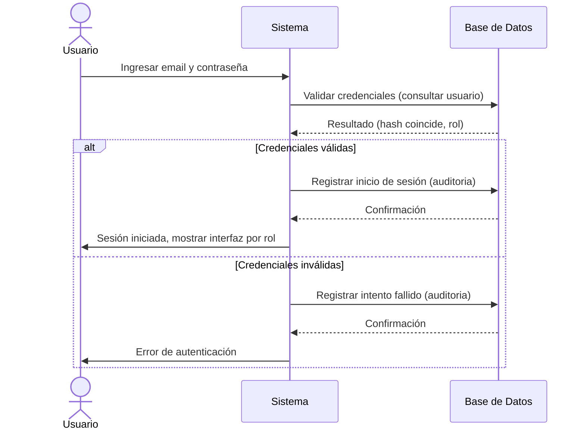
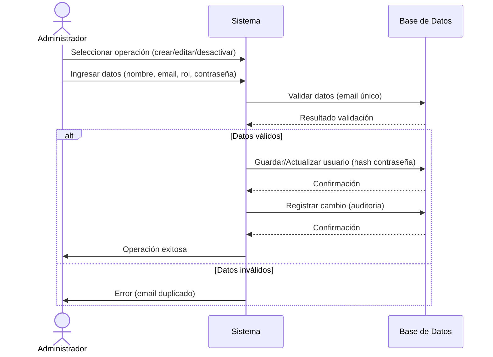
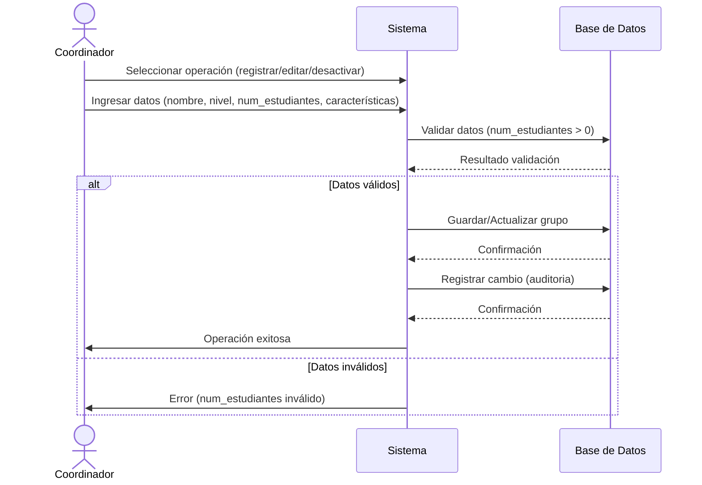
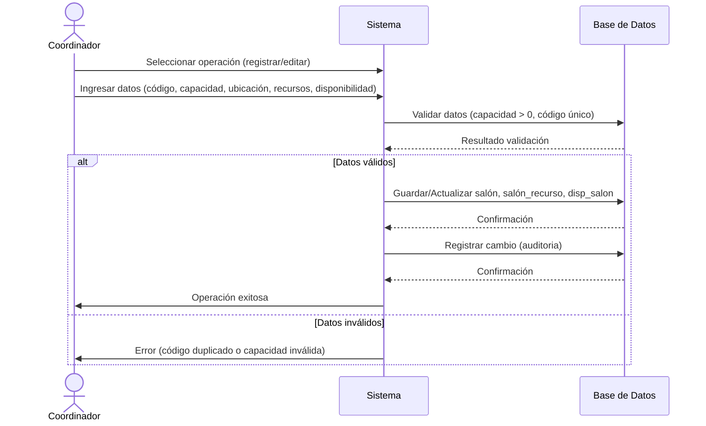
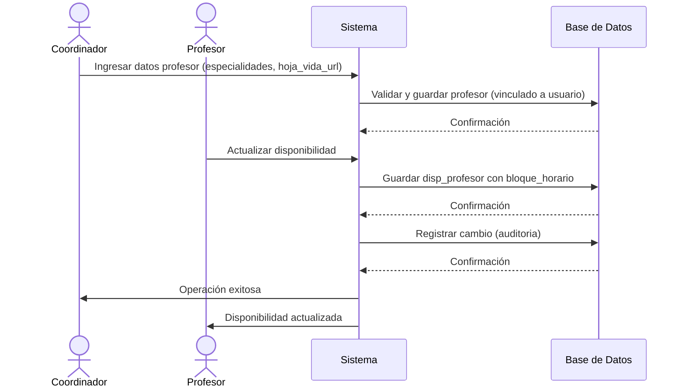
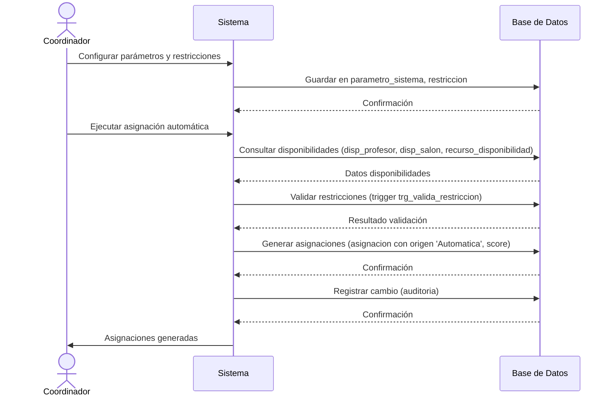
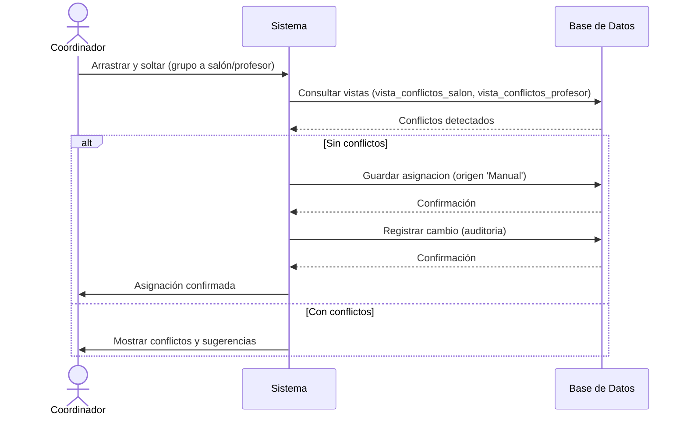
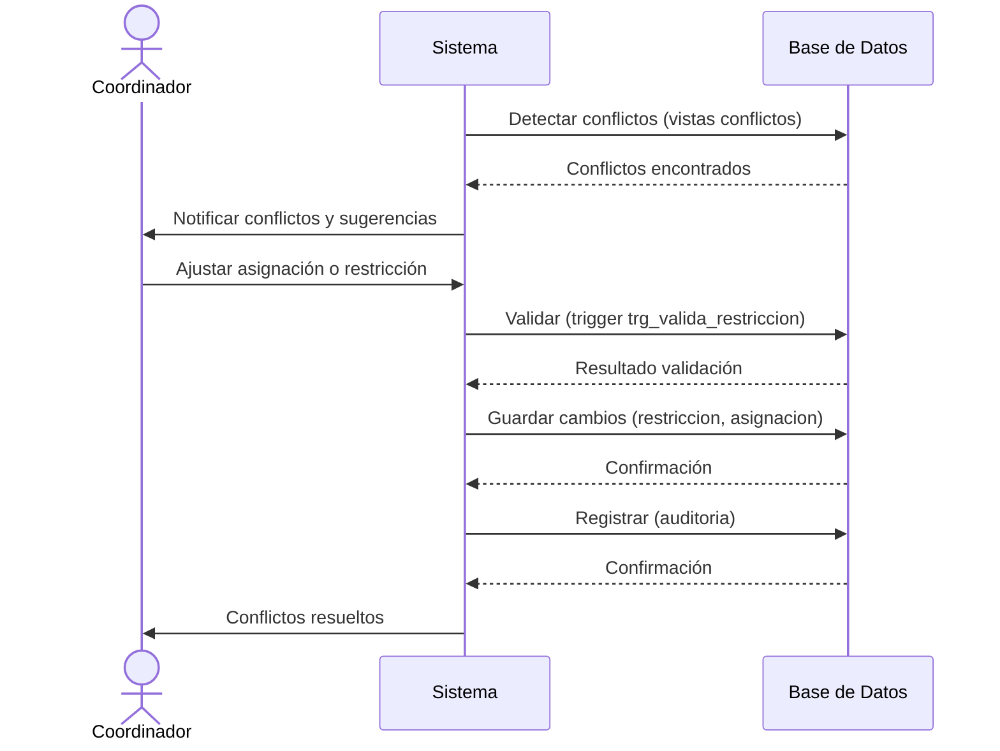
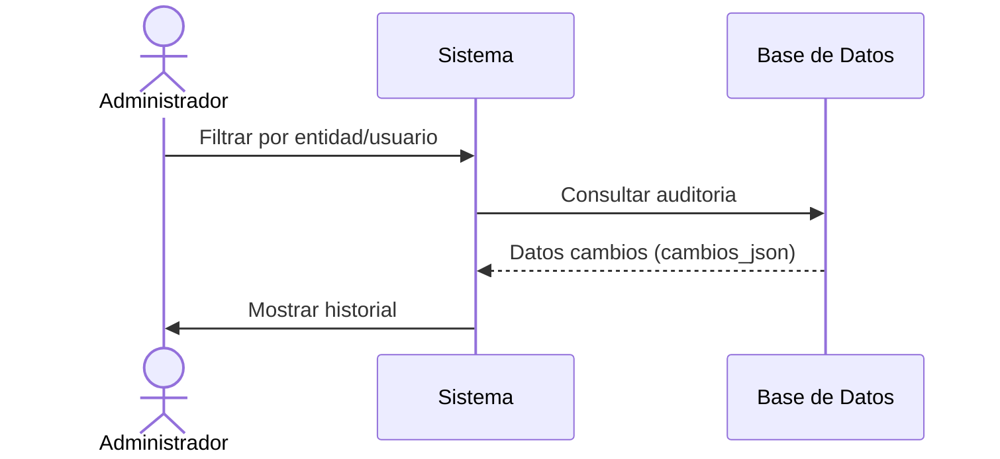
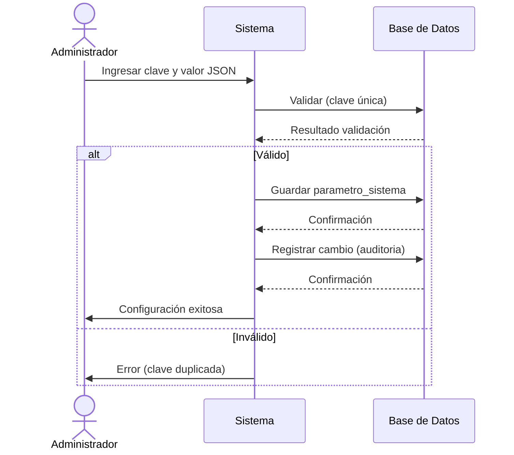

---

## Caso de Uso: Iniciar Sesión (HU2)
secuencia_iniciar_sesion.mmdmermaid


---

---

## Caso de Uso: Gestionar Usuarios (HU1)
secuencia_gestionar_usuarios.mmdmermaid


---

---

## Caso de Uso: Gestionar Grupos (HU3, HU4)
secuencia_gestionar_grupos.mmdmermaid


---

---

## Caso de Uso: Gestionar Salones (HU5, HU6)
secuencia_gestionar_salones.mmdmermaid


---

---

## Caso de Uso: Gestionar Profesores (HU7, HU8)
secuencia_gestionar_profesores.mmdmermaid


---

---

## Caso de Uso: Ejecutar Asignación Automática (HU9, HU10)
secuencia_asignacion_automatica.mmdmermaid


---

---

## Caso de Uso: Realizar Asignación Manual (HU11, HU12)
secuencia_asignacion_manual.mmdmermaid


---

---

## Caso de Uso: Visualizar Horarios (HU13, HU14)
secuencia_visualizar_horarios.mmdmermaid

```mermaid
sequenceDiagram
    actor Actor as Coordinador/Profesor
    participant Sistema
    participant BD as Base de Datos
    Actor->>Sistema: Seleccionar tipo de horario (completo/personal)
    Sistema->>BD: Consultar asignacion, bloque_horario, periodo_academico
    BD-->>Sistema: Datos horarios
    Sistema->>Actor: Mostrar horario
```
---

---

## Caso de Uso: Generar Reportes (HU15)
secuencia_generar_reportes.mmdmermaid

```mermaid
sequenceDiagram
    actor Actor as Administrador/Coordinador
    participant Sistema
    participant BD as Base de Datos
    Actor->>Sistema: Seleccionar tipo de reporte
    Sistema->>BD: Consultar reporte_ocupacion, vistas conflictos
    BD-->>Sistema: Datos reportes
    Sistema->>Actor: Generar y mostrar reporte
```
---

---

## Caso de Uso: Gestionar Conflictos (HU16, HU17)
secuencia_gestionar_conflictos.mmdmermaid


---

---

## Caso de Uso: Visualizar Historial (HU18)
secuencia_visualizar_historial.mmdmermaid


---

---

## Caso de Uso: Configurar Sistema (HU19)
secuencia_configurar_sistema.mmdmermaid


---