# Diagrama de Casos de Uso: Sistema de Asignación de Salones

## Introducción
Este diagrama de casos de uso modela el Sistema de Asignación de Salones para un centro educativo, integrando roles principales y adicionales para una gestión robusta de recursos, asignaciones y reportes. Usa un flujo vertical para claridad.

## Descripciones de Casos de Uso
A continuación, una breve descripción de cada caso de uso (UC), agrupados por épica para referencia:

### Épica 1: Usuarios y Autenticación
- **UC1: Crear/Gestionar Cuentas**: Permite a administradores y secretarias crear, editar o eliminar cuentas de usuarios con roles específicos para control de acceso.
- **UC2: Iniciar Sesión**: Autentica a usuarios (todos los roles) para acceder a funcionalidades según permisos.

### Épica 2: Grupos
- **UC3: Registrar/Editar Grupos**: Registra o modifica detalles de grupos de estudiantes (nombre, nivel, tamaño, características especiales) por coordinadores académicos o generales.

### Épica 3: Salones
- **UC5: Registrar/Gestionar Salones**: Añade o actualiza info de salones (capacidad, recursos, ubicación) por coordinadores de infraestructura.
- **UC6: Gestionar Disponibilidad**: Configura horarios y restricciones de uso de salones.

### Épica 4: Profesores
- **UC7: Registrar/Gestionar Profesores**: Registra o edita perfiles de profesores (datos personales, especialidades, CV) por coordinadores.
- **UC8: Gestionar Disponibilidad**: Actualiza horarios y preferencias de profesores (compartido con ellos mismos).

### Épica 5: Asignación Automática
- **UC9: Ejecutar Algoritmo Automático**: Lanza asignaciones óptimas considerando disponibilidades y preferencias (incluye UC10).
- **UC10: Configurar Parámetros**: Define prioridades para el algoritmo (ej: proximidad de salones).

### Épica 6: Asignación Manual
- **UC11: Realizar Asignación Manual**: Asigna recursos manualmente con interfaz visual.
- **UC12: Visualizar Conflictos**: Visualiza conflictos en tiempo real.

### Épica 7: Visualización y Reportes
- **UC13: Visualizar Horario Semestral**: Ve el horario completo.
- **UC14: Visualizar Horario Personal**: Consulta horarios personales.
- **UC15: Generar Reportes**: Genera reportes de utilización.

### Épica 8: Gestión de Conflictos
- **UC16: Notificar Conflictos**: Notifica conflictos y sugiere alternativas.
- **UC17: Establecer Restricciones**: Establece restricciones para recursos.

### Épica 9: Historial y Auditoría
- **UC18: Visualizar Historial**: Ve historial de cambios.

### Épica 10: Configuración
- **UC19: Configurar Sistema**: Configura parámetros generales.

### Diagrama de Casos de Uso (Actualizado)

```mermaid
graph TD
    %% Actores (con sub-roles para visibilidad)
    subgraph "Actores/Roles"
        A[Administrador]:::actor
        SA[Superadministrador]:::actor
        C[Coordinador General]:::actor
        CA[Coordinador Académico]:::actor
        CI[Coordinador de Infraestructura]:::actor
        S[Secretaría General]:::actor
        SAca[Secretaría Académica]:::actor
        SInf[Secretaría de Infraestructura]:::actor
        P[Profesor]:::actor
        PI[Profesor Invitado]:::actor
    end

    %% Casos de Uso por Épica
    subgraph "Épica 1: Usuarios"
        UC1((UC1: Crear/Gestionar Cuentas)):::usecase
        UC2((UC2: Iniciar Sesión)):::usecase
    end

    subgraph "Épica 2: Grupos"
        UC3((UC3: Registrar/Editar Grupos)):::usecase
    end

    subgraph "Épica 3: Salones"
        UC5((UC5: Registrar/Gestionar Salones)):::usecase
        UC6((UC6: Gestionar Disponibilidad)):::usecase
    end

    subgraph "Épica 4: Profesores"
        UC7((UC7: Registrar/Gestionar Profesores)):::usecase
        UC8((UC8: Gestionar Disponibilidad)):::usecase
    end

    subgraph "Épica 5: Automática"
        UC9((UC9: Ejecutar Algoritmo)):::usecase
        UC10((UC10: Configurar Parámetros)):::usecase
    end

    subgraph "Épica 6: Manual"
        UC11((UC11: Asignación Manual)):::usecase
        UC12((UC12: Visualizar Conflictos)):::usecase
    end

    subgraph "Épica 7: Visualización"
        UC13((UC13: Horario Semestral)):::usecase
        UC14((UC14: Horario Personal)):::usecase
        UC15((UC15: Reportes)):::usecase
    end

    subgraph "Épica 8: Conflictos"
        UC16((UC16: Notificar Conflictos)):::usecase
        UC17((UC17: Restricciones)):::usecase
    end

    subgraph "Épica 9: Historial"
        UC18((UC18: Visualizar Historial)):::usecase
    end

    subgraph "Épica 10: Configuración"
        UC19((UC19: Configurar Sistema)):::usecase
    end

    %% Relaciones (flujo vertical, con extend para herencia)
    A -.-> UC1
    A -.-> UC2
    A -.-> UC15
    A -.-> UC18
    A -.-> UC19
    SA -.-> UC1
    SA -.-> UC2
    C -.-> UC2
    C -.-> UC3
    C -.-> UC7
    C -.-> UC9
    C -.-> UC11
    C -.-> UC13
    C -.-> UC16
    CA -.-> UC3
    CA -.-> UC7
    CI -.-> UC5
    CI -.-> UC6
    S -.-> UC1
    S -.-> UC15
    SAca -.-> UC3
    SInf -.-> UC5
    P -.-> UC2
    P -.-> UC8
    P -.-> UC14
    PI -.-> UC2
    PI -.-> UC8

    %% Estilos Atractivo
    classDef actor fill:#e3f2fd,stroke:#1976d2,stroke-width:3px,color:#000
    classDef usecase fill:#f3e5f5,stroke:#7b1fa2,stroke-width:2px,shape:ellipse,color:#000
    classDef epic fill:#f5f5f5,stroke:#666,stroke-width:1px
```

### Roles en el Sistema de Asignación de Salones

Todos estos roles deben **iniciar sesión** (UC2) para acceder al sistema, con restricciones basadas en permisos (RBAC). A continuación, detallo **qué hace cada uno** (actividades principales) y **sus restricciones específicas**.

| Rol                          | Actividades Principales (Qué Hace) | Restricciones Específicas |
|------------------------------|-----------------------------------|---------------------------|
| **Secretaría** (General)    | Apoya en creación de cuentas, gestiona solicitudes de cambios en horarios, genera/distribuye reportes básicos y mantiene auditoría rutinaria. | Acceso limitado a lectura/edición básica (no asignaciones ni configs globales). Depende de aprobaciones superiores. Solo visualiza datos no sensibles. |
| **Superadministrador**      | Gestiona backups/restauraciones, integra con herramientas externas (ej: LMS), monitorea rendimiento global y aprueba cambios estructurales. | Acceso exclusivo y auditado (solo para IT/directivos). No interfiere en operaciones diarias. Requiere logs avanzados con doble verificación. |
| **Administrador**           | Crea/gestiona cuentas, genera reportes de recursos/estadísticas, visualiza historial/auditoría y configura parámetros generales (períodos, días laborables). | Acceso total pero controlado por rol (no ejecución de asignaciones). Debe registrar todas las acciones para auditoría. |
| **Profesor**                | Inicia sesión, visualiza horario personal y salones asignados, actualiza su disponibilidad horaria y preferencias. | Acceso solo a datos personales (no edición global). Dependiente de asignaciones de coordinadores; no ve horarios ajenos. |
| **Secretaría de Infraestructura** | Actualiza disponibilidades de salones (ej: por mantenimiento), genera reportes de uso de recursos físicos y notifica restricciones. | Enfocado solo en datos de salones/infraestructura; no accede a horarios académicos o grupos. Requiere aprobación para cambios. |
| **Coordinador Académico**   | Registra/edita grupos y profesores (enfoque en datos académicos como niveles/especialidades), coordina preferencias pedagógicas y aprueba horarios propuestos. | No gestiona infraestructura física; reporta a coordinador general. Limitado a filtros académicos, sin configs globales. |
| **Secretaria Académica**    | Maneja registros administrativos de grupos/profesores, distribuye horarios a estudiantes/familias y exporta a calendarios externos. | No asigna salones ni edita disponibilidades; solo datos no sensibles. Acceso temporal a info de estudiantes (con privacidad GDPR-like). |
| **Profesor Invitado**       | Visualiza horarios temporales y salones asignados, reporta disponibilidades limitadas y recibe notificaciones por email/SMS. | Acceso caduco (expira automáticamente); sin edición profunda ni gestión de recursos. Solo para sesiones puntuales. |
| **Coordinador General**   | Registra/edita grupos/profesores, ejecuta asignaciones automáticas/manuales, visualiza horarios/conflictos y establece restricciones. | Dependiente de disponibilidades reales; no configs globales (eso es de admin). Acceso amplio pero no ilimitado a datos sensibles. |
| **Coordinador de Infraestructura** | Registra/gestiona salones (capacidad, recursos, ubicación) y configura su disponibilidad horaria/restricciones de uso. | Enfocado solo en recursos físicos; no ve/edita datos académicos. Cambios requieren validación para evitar conflictos. |
