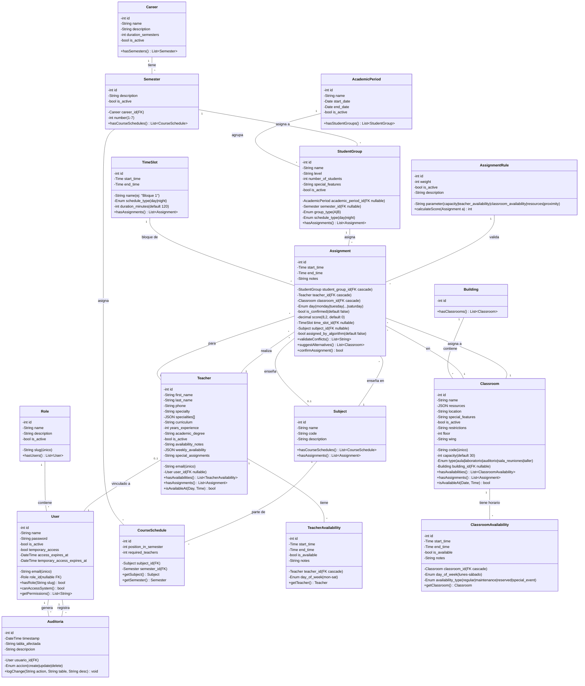

# Diagrama de Clases: Sistema de Asignación de Salones

## Introducción
Este diagrama de clases refleja la estructura real del proyecto Laravel. Basado en migraciones y modelos existentes, incluye:

- **Autenticación**: Role, User (con role_id nullable).
- **Académico**: Teacher, StudentGroup, Subject, Semester, Career, CourseSchedule, AcademicPeriod.
- **Infraestructura**: Classroom, Building, ClassroomAvailability.
- **Horarios**: TimeSlot, Assignment, TeacherAvailability.
- **Sistema**: AssignmentRule, Auditoria.

Los 8 roles del sistema son: `Administrador`, `Secretaria Administrativa`, `Coordinador`, `Secretaria de Coordinación`, `Coordinador de Infraestructura`, `Secretaria de Infraestructura`, `Profesor`, `Profesor Invitado`.

## Diagrama Mermaid

## Notas de Implementación

### Correspondencia con Laravel
- **Role** → `app/Modules/Auth/Models/Role.php`
- **User** → `app/Models/User.php`
- **Teacher** → `app/Modules/GestionAcademica/Models/Teacher.php`
- **StudentGroup** → `app/Modules/GestionAcademica/Models/StudentGroup.php`
- **Subject** → `app/Models/Subject.php`
- **Classroom** → `app/Modules/Infraestructura/Models/Classroom.php`
- **Assignment** → `app/Modules/Asignacion/Models/Assignment.php`
- **TimeSlot** → `app/Models/TimeSlot.php`

### Migraciones Base
Todas las tablas se crean con `php artisan migrate --seed`. Las migraciones incluyen índices, constraints (CASCADE/RESTRICT), y valores por defecto según se muestra en el diagrama.

### Roles y Permisos (8 roles reales)
Los roles se crean en `database/seeders/RoleSeeder.php`:
1. `administrador` - Acceso completo al sistema
2. `secretaria_administrativa` - Gestión administrativa y reportes
3. `coordinador` - Gestión académica y asignaciones
4. `secretaria_coordinacion` - Apoyo académico y distribución de horarios
5. `coordinador_infraestructura` - Gestión de salones y recursos
6. `secretaria_infraestructura` - Apoyo en gestión de infraestructura
7. `profesor` - Acceso a horarios personales y disponibilidades
8. `profesor_invitado` - Acceso temporal al sistema

Los permisos se validan en `app/Http/Middleware/RoleMiddleware.php` mediante `role_id` en la tabla `users`.

### Validaciones en Assignment
- Conflictos de horario (profesor, salón, estudiantes en la misma fecha/hora).
- Capacidad: `StudentGroup.number_of_students <= Classroom.capacity`.
- Disponibilidades: Consultadas desde `TeacherAvailability` y `ClassroomAvailability`.
- Reglas de asignación: Definidas en `AssignmentRule` (weights para algoritmo automático).
- Transiciones: `assigned_by_algorithm` indica si fue generada por el algoritmo o manual.
