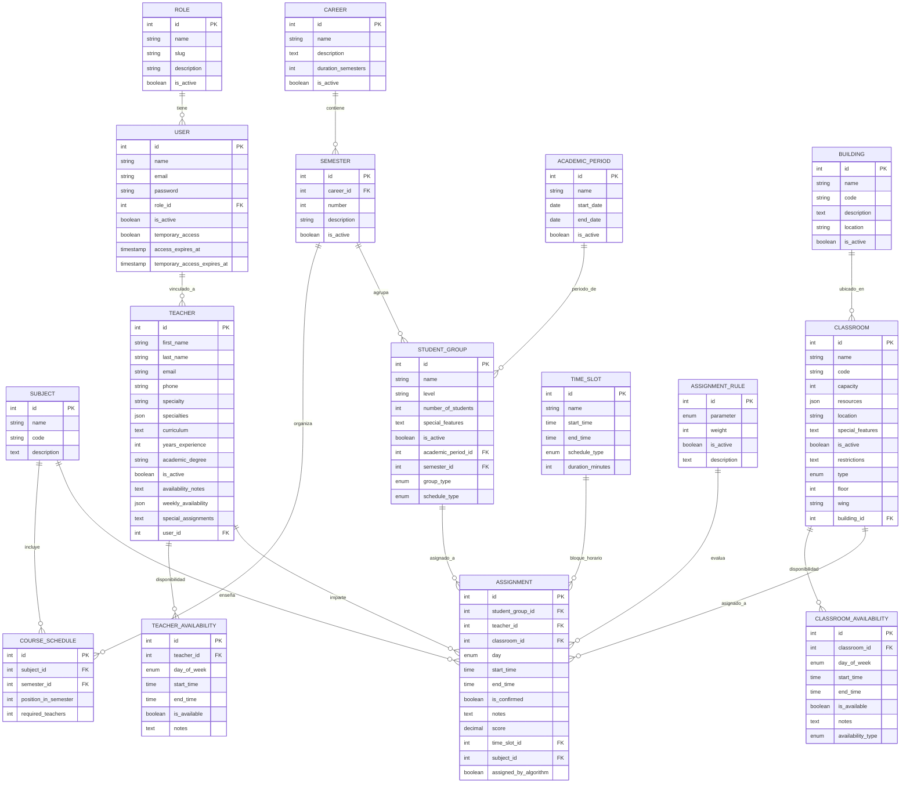

# Diagrama Entidad-Relación (ERD): Sistema de Asignación de Salones

## Descripción General
Este diagrama usa **notación Crow's Foot moderna** para representar la estructura de base de datos del sistema Laravel. A diferencia de documentación previa, refleja la **arquitectura real**: PostgreSQL/SQLite con modelo **Role→User (FK)** en lugar de herencia por tablas separadas.

**Características clave:**
- **8 roles reales** (no 10 ficticios): Definidos en `RoleSeeder.php`
- **Estructura simplificada**: `users.role_id` FK a `roles`, no tablas ADMINISTRADOR/COORDINADOR separadas
- **Entidades académicas**: Careers, Semesters, Subjects, CourseSchedules, AcademicPeriods
- **Gestión de recursos**: Teachers, StudentGroups, Classrooms, Buildings, TimeSlots
- **Sistema de asignaciones**: Assignments con reglas, disponibilidades, conflictos
- **Cardinalidades precisas**: `||--o{` (1:N), `||--||` (1:1), `o{--o{` (N:M vía pivot)

## Roles del Sistema (8 roles reales)
Todos los roles se almacenan en la tabla `roles` y se asignan a usuarios vía `users.role_id`:

1. **Administrador** (`administrador`) - Acceso completo al sistema
2. **Secretaria Administrativa** (`secretaria_administrativa`) - Gestión administrativa y reportes
3. **Coordinador** (`coordinador`) - Gestión académica y asignaciones
4. **Secretaria de Coordinación** (`secretaria_coordinacion`) - Apoyo en gestión académica
5. **Coordinador de Infraestructura** (`coordinador_infraestructura`) - Gestión de salones y recursos
6. **Secretaria de Infraestructura** (`secretaria_infraestructura`) - Apoyo en gestión de infraestructura
7. **Profesor** (`profesor`) - Acceso a horarios personales
8. **Profesor Invitado** (`profesor_invitado`) - Acceso temporal al sistema

**Nota**: No existen Superadministrador, CoordinadorAcademico, ni SecretariaAcademica como roles separados. Estas funciones se manejan vía permisos del rol `administrador` o `coordinador`.


## Diagrama Mermaid (ERD Real - PostgreSQL/Laravel)


## Notas de Implementación

### Diferencias con Documentación Anterior
- **❌ Eliminado**: Tablas ADMINISTRADOR, SUPERADMINISTRADOR, COORDINADOR_ACADEMICO, SECRETARIA_ACADEMICA (nunca implementadas)
- **✅ Agregado**: CAREER, SEMESTER, SUBJECT, COURSE_SCHEDULE, ACADEMIC_PERIOD, BUILDING, TIME_SLOT
- **✅ Corregido**: Estructura de roles simplificada (role_id FK en USER)
- **✅ Actualizado**: PostgreSQL/SQLite en lugar de MySQL (sin triggers/particiones/vistas materializadas)

### Migraciones Base
Las tablas se crean vía `php artisan migrate --seed`. Principales migraciones:
- `create_roles_table` - 8 roles con slug único
- `create_users_table` - role_id nullable FK a roles
- `create_teachers_table` - user_id nullable FK a users
- `create_student_groups_table` - group_type (A|B), schedule_type (day|night)
- `create_classrooms_table` - JSON resources, enum type (aula|laboratorio|auditorio|sala_reuniones|taller)
- `create_assignments_table` - Múltiples FKs (CASCADE para student_group/teacher/classroom)
- `create_time_slots_table` - Bloques horarios pre-definidos
- `create_assignment_rules_table` - Parámetros del algoritmo de asignación

### Constraints y Relaciones
- **CASCADE**: assignment→student_group, assignment→teacher, assignment→classroom (al eliminar recurso, elimina asignaciones)
- **RESTRICT**: assignment→time_slot, assignment→subject (no permite eliminar si hay asignaciones activas)
- **NULLABLE**: user→role, teacher→user, student_group→academic_period (opcionales)
- **UNIQUE**: users.email, classrooms.code, roles.slug
- **DEFAULT**: classrooms.capacity (30), assignments.is_confirmed (false), assignments.score (0)

### Tipos Especiales PostgreSQL
- **ENUM**: day_of_week, schedule_type, group_type, classroom_type, availability_type
- **JSON/JSONB**: resources (classroom), specialties (teacher), weekly_availability (teacher)
- **TIME**: start_time, end_time en time_slots/availabilities
- **DATE**: academic_period fechas de inicio/fin
- **DECIMAL(8,2)**: score en assignments

### Índices Recomendados
- `users(email)` - Búsquedas de login
- `assignments(student_group_id, day, start_time)` - Detección de conflictos
- `teachers(email)` - Búsquedas únicas
- `classrooms(code)` - Identificación rápida
- `roles(slug)` - Validación de permisos

```mermaid
erDiagram
    %% Entidad Base Usuario (arriba para flujo visual)
    USUARIO {
        int id PK
        string nombre
        string email
        string password
        string rol
    }

    %% Subentidades/Roles (agrupadas lógicamente)
    ADMINISTRADOR {
        int id PK
        int usuario_id FK
        string nivel_acceso
    }
    SUPERADMINISTRADOR {
        int id PK
        int usuario_id FK
        string api_keys
    }
    COORDINADOR {
        int id PK
        int usuario_id FK
        string especialidad
    }
    COORDINADOR_ACADEMICO {
        int id PK
        int coordinador_id FK
        string foco_academico
    }
    COORDINADOR_INFRAESTRUCTURA {
        int id PK
        int coordinador_id FK
        string area_mantenimiento
    }
    SECRETARIA {
        int id PK
        int usuario_id FK
        string departamento
    }
    SECRETARIA_ACADEMICA {
        int id PK
        int secretaria_id FK
        string contacto_familias
    }
    SECRETARIA_INFRAESTRUCTURA {
        int id PK
        int secretaria_id FK
        string alertas_mantenimiento
    }
    PROFESOR {
        int id PK
        int usuario_id FK
        string especialidad
        string hoja_vida
    }
    PROFESOR_INVITADO {
        int id PK
        int profesor_id FK
        date fecha_expiracion
    }

    %% Entidades de Recursos (medio)
    GRUPO {
        int id PK
        string nombre
        int nivel
        int numEstudiantes
        string caracteristicas
        int coordinador_id FK
    }
    SALON {
        int id PK
        int capacidad
        string recursos
        string ubicacion
        int coordinador_infra_id FK
    }

    %% Entidades de Gestión (abajo)
    ASIGNACION {
        int id PK
        date fecha
        int grupo_id FK
        int salon_id FK
        int profesor_id FK
        int horario_id FK
    }
    HORARIO {
        int id PK
        date periodo
        int coordinador_id FK
    }
    REPORTE {
        int id PK
        string tipo
        date fechaGeneracion
        int admin_id FK
    }
    RESTRICCION {
        int id PK
        string tipo
        string descripcion
        int asignacion_id FK
        int coordinador_id FK
    }
    AUDITORIA {
        int id PK
        date timestamp
        string accion
        int usuario_id FK
    }
    PARAMETRO {
        string clave PK
        string valor
        int admin_id FK
    }

    %% Relaciones Herencia (1:N para subtipos, moderna y clara)
    USUARIO ||--o{ ADMINISTRADOR : "es (1:N)"
    USUARIO ||--|| SUPERADMINISTRADOR : "es (1:1)"
    USUARIO ||--o{ COORDINADOR : "es (1:N)"
    COORDINADOR ||--o{ COORDINADOR_ACADEMICO : "especializa (1:N)"
    COORDINADOR ||--o{ COORDINADOR_INFRAESTRUCTURA : "especializa (1:N)"
    USUARIO ||--o{ SECRETARIA : "es (1:N)"
    SECRETARIA ||--o{ SECRETARIA_ACADEMICA : "especializa (1:N)"
    SECRETARIA ||--o{ SECRETARIA_INFRAESTRUCTURA : "especializa (1:N)"
    USUARIO ||--o{ PROFESOR : "es (1:N)"
    PROFESOR ||--o{ PROFESOR_INVITADO : "especializa (1:N)"

    %% Relaciones Rol-Recurso/Gestión (flujo descendente)
    COORDINADOR ||--o{ GRUPO : "gestiona (1:N)"
    COORDINADOR_INFRAESTRUCTURA ||--o{ SALON : "gestiona (1:N)"
    COORDINADOR ||--o{ HORARIO : "aprueba (1:N)"
    ADMINISTRADOR ||--o{ REPORTE : "genera (1:N)"
    COORDINADOR ||--o{ RESTRICCION : "establece (1:N)"
    USUARIO ||--o{ AUDITORIA : "registra (1:N)"
    ADMINISTRADOR ||--o{ PARAMETRO : "configura (1:N)"

    %% Relaciones Gestión (centrales, con N:M si aplica)
    GRUPO ||--o{ ASIGNACION : "participa (1:N)"
    SALON ||--o{ ASIGNACION : "asignado (1:N)"
    PROFESOR ||--o{ ASIGNACION : "imparte (1:N)"
    HORARIO ||--o{ ASIGNACION : "contiene (1:N)"
    ASIGNACION ||--o{ RESTRICCION : "sujeta (1:N)"

    %% Notas para robustez y visual
    %% PK: Clave Primaria | FK: Clave Foránea
    %% Cardinalidades: ||--o{ (uno a muchos) | ||--|| (uno a uno)
    %% Flujo: Roles (arriba) → Recursos (medio) → Gestión (abajo) para intuición.
