# Diagrama de Flujo de Datos (DFD): Sistema de Asignación de Salones

## Descripción General
DFD que modela flujos de datos por épicas/HU: entidades externas (**8 roles reales**), procesos (funcionalidades), flujos etiquetados y stores (BD PostgreSQL). Nivel 0: Contexto global. Nivel 1: Descompuesto. Visual: Subgraphs agrupados, emojis, colores (azul: entidades, morado: procesos, naranja: stores).

**Actualización**: Refleja arquitectura real Laravel con 8 roles del `RoleSeeder` (no 10 roles ficticios). Elimina referencias a Superadministrador, CoordinadorAcademico, SecretariaAcademica.

## Roles del Sistema (Entidades Externas)
1. **Administrador** - Gestión completa, reportes, configuración
2. **Secretaria Administrativa** - Soporte administrativo
3. **Coordinador** - Gestión académica y asignaciones (incluye funciones de "académico" previas)
4. **Secretaria de Coordinación** - Apoyo académico
5. **Coordinador de Infraestructura** - Gestión de salones
6. **Secretaria de Infraestructura** - Apoyo en infraestructura
7. **Profesor** - Consulta horarios personales
8. **Profesor Invitado** - Acceso temporal

## Descripciones Detalladas
- **Entidades**: Roles como fuentes (ej: Coordinador envía "Datos Grupo")
- **Procesos**: Por épica (ej: P6: Asignación Auto valida disponibilidades)
- **Flujos**: Etiquetas clave (ej: "Conflicto Log" → D6)
- **Stores**: Tablas BD (ej: D3: ASSIGNMENT, D2: TEACHER/CLASSROOM/STUDENT_GROUP)

### Diagrama Mermaid (Nivel 0 y 1)

```mermaid
flowchart TD
    classDef entity fill:#e1f5fe,stroke:#01579b,stroke-width:2px
    classDef process fill:#f3e5f5,stroke:#4a148c,stroke-width:2px
    classDef store fill:#fff3e0,stroke:#ef6c00,stroke-width:2px

    %% Nivel 0: Contexto (8 roles reales)
    subgraph Nivel0 ["🌐 Nivel 0: Contexto"]
        E1[👨‍💼 Administrador]:::entity
        E2[👨‍🏫 Coordinador]:::entity
        E3[🏗️ Coord. Infraestructura]:::entity
        E4[💼 Sec. Administrativa]:::entity
        E5[📋 Sec. Coordinación]:::entity
        E6[🔧 Sec. Infraestructura]:::entity
        E7[👨‍🏫 Profesor]:::entity
        E8[🎓 Profesor Invitado]:::entity
        P0[Sistema Asignación]:::process
        D0[(🗄️ BD PostgreSQL)]:::store

        E1 -.->|"Cred/Config"| P0
        E2 -.->|"Recursos/Asig"| P0
        E3 -.->|"Salones"| P0
        E4 -.->|"Soporte Admin"| P0
        E5 -.->|"Apoyo Académico"| P0
        E6 -.->|"Apoyo Infra"| P0
        E7 -.->|"Disponibilidad"| P0
        E8 -.->|"Consulta Temporal"| P0
        P0 -.->|"Datos/Notif"| D0
        D0 -.->|"Respuestas"| P0
        P0 -.->|"Reportes"| E1
        P0 -.->|"Conflictos"| E2
        P0 -.->|"Horarios"| E7
    end

    %% Nivel 1: Descompuesto
    subgraph Nivel1 ["📊 Nivel 1: Por Épicas"]
        subgraph Ep1 ["🛡️ Ép1: Usuarios"]
            P1[P1: Auth]:::process
            P2[P2: Cuentas]:::process
        end
        subgraph Ep234 ["👥 Ép2-4: Recursos"]
            P3[P3: Grupos]:::process
            P4[P4: Salones]:::process
            P5[P5: Profesores]:::process
        end
        subgraph Ep56 ["🤖 Ép5-6: Asignaciones"]
            P6[P6: Auto]:::process
            P7[P7: Manual]:::process
            P8[P8: Validación]:::process
        end
        subgraph Ep7 ["📊 Ép7: Visualización"]
            P9[P9: Horarios]:::process
            P10[P10: Personal]:::process
            P11[P11: Reportes]:::process
        end
        subgraph Ep8 ["⚠️ Ép8: Conflictos"]
            P12[P12: Detección]:::process
            P13[P13: Restricciones]:::process
            P14[P14: Notificaciones]:::process
        end

        subgraph Stores ["🗄️ Stores (Tablas PostgreSQL)"]
            D1[(D1: roles, users)]:::store
            D2[(D2: teachers, student_groups, classrooms, subjects)]:::store
            D3[(D3: assignments)]:::store
            D4[(D4: teacher_availabilities, classroom_availabilities)]:::store
            D5[(D5: assignment_rules)]:::store
        end

        %% Flujos compactos (8 roles reales)
        E1 -->|"Admin Creds"| P1
        E2 -->|"Coord Login"| P1
        E7 -->|"Prof Login"| P1
        P1 -->|"Validate"| D1
        D1 -->|"Role Data"| P1
        
        E1 -->|"Create User"| P2
        P2 -->|"User Data"| D1
        
        E2 -->|"Datos Grupo"| P3
        E5 -->|"Apoyo Registro"| P3
        P3 -->|"Reg Grupo"| D2
        D2 -->|"Grupos Exist"| P3
        
        E3 -->|"Info Salón"| P4
        E6 -->|"Actualizar Disp"| P4
        P4 -->|"Salón Disp"| D2
        D2 -->|"Salones"| P4
        
        E2 -->|"Datos Prof"| P5
        P5 -->|"Prof Disp"| D2
        D2 -->|"Profesores"| P5
        
        E2 -->|"Exec Algoritmo"| P6
        P6 <-->|"Reglas/Data"| D5
        P6 <-->|"Recursos"| D2
        P6 <-->|"Disponibilidades"| D4
        P6 -->|"Asig Generada"| D3
        
        E2 -->|"Asig Manual"| P7
        P7 -->|"Asig Nueva"| D3
        D3 -->|"Validar"| P8
        P8 -->|"Conflictos"| E2
        
        E2 -->|"Ver Horarios"| P9
        P9 <-->|"Assignments"| D3
        P9 -->|"Vista Sem"| E2
        
        E7 -->|"Ver Personal"| P10
        E8 -->|"Ver Temporal"| P10
        P10 <-->|"Asig Usuario"| D3
        P10 -->|"Vista Personal"| E7
        P10 -->|"Vista Temp"| E8
        
        E1 -->|"Solicitar Report"| P11
        P11 <-->|"Estadísticas"| D3
        P11 -->|"Reporte Gen"| E1
        
        P7 -->|"Detect Auto"| P12
        P12 <-->|"Check Conflicts"| D3
        P12 <-->|"Disponib"| D4
        P12 -->|"Conflictos"| P14
        
        E2 -->|"Def Restricción"| P13
        P13 -->|"Regla App"| D5
        
        P14 -->|"Notificar"| E2
        P14 -->|"Sugerencias"| E2
    end

    P0 -.-> Nivel1
```

## Notas de Implementación

### Mapeo Procesos → Tablas PostgreSQL
- **P1 (Auth)**: Consulta `users`, `roles` para validar credenciales y permisos
- **P2 (Cuentas)**: INSERT/UPDATE en `users` con `role_id` FK
- **P3 (Grupos)**: CRUD en `student_groups` con `semester_id`, `academic_period_id`
- **P4 (Salones)**: CRUD en `classrooms` con JSONB `resources`, enum `type`
- **P5 (Profesores)**: CRUD en `teachers` con JSONB `specialties`, `weekly_availability`
- **P6 (Asignación Auto)**: Algoritmo que lee `assignment_rules`, `teacher_availabilities`, `classroom_availabilities` y escribe en `assignments`
- **P7 (Asignación Manual)**: INSERT directo en `assignments` con validaciones
- **P8 (Validación)**: CHECK constraints, queries para detectar overlaps en horarios
- **P9 (Horarios)**: SELECT de `assignments` JOIN `teachers`, `classrooms`, `student_groups`
- **P10 (Personal)**: SELECT filtrado por `teacher_id` o `user_id`
- **P11 (Reportes)**: Queries agregadas (COUNT, AVG score) sobre `assignments`
- **P12 (Detección Conflictos)**: Index scan en `(student_group_id, day, start_time)`
- **P13 (Restricciones)**: INSERT/UPDATE en `assignment_rules` con parámetros y pesos
- **P14 (Notificaciones)**: Lógica Laravel (mails, eventos) basada en resultados de P12

### Diferencias con Documentación Anterior
- **❌ Eliminado**: Entidades Superadministrador, CoordinadorAcademico, SecretariaAcademica (roles inexistentes)
- **❌ Eliminado**: Stores D4 (Auditoría), D5 (Reportes), D6 (Conflictos) como tablas separadas (se manejan vía queries)
- **✅ Actualizado**: 8 roles reales del `RoleSeeder`
- **✅ Agregado**: Stores D4 (availabilities), D5 (assignment_rules) que sí existen en migraciones
- **✅ Corregido**: Flujos ahora mapean a tablas reales (teachers, student_groups, assignments, etc.)

### Flujos Clave por Rol

**Administrador (E1)**:
- E1 → P1 (login) → D1 (users/roles)
- E1 → P2 (crear cuentas) → D1
- E1 → P11 (reportes) → D3 (assignments)

**Coordinador (E2)**:
- E2 → P1 (login) → D1
- E2 → P3 (grupos) → D2 (student_groups)
- E2 → P5 (profesores) → D2 (teachers)
- E2 → P6 (asignación auto) → D2, D4, D5 → D3 (assignments)
- E2 → P7 (asignación manual) → D3
- E2 → P9 (ver horarios) → D3
- E2 → P12 (conflictos) → D3, D4
- E2 → P13 (restricciones) → D5 (assignment_rules)

**Coordinador de Infraestructura (E3)**:
- E3 → P4 (salones) → D2 (classrooms)
- E3 → P4 (disponibilidades) → D4 (classroom_availabilities)

**Secretarias (E4, E5, E6)**:
- E4/E5/E6 → P1 (login) → D1
- E5 → P3 (apoyo registro grupos) → D2
- E6 → P4 (actualizar disponibilidades salones) → D4

**Profesores (E7, E8)**:
- E7/E8 → P1 (login) → D1
- E7/E8 → P10 (horarios personales) → D3 (filtro por teacher_id)
- E7 → P5 (actualizar disponibilidad) → D4 (teacher_availabilities)

