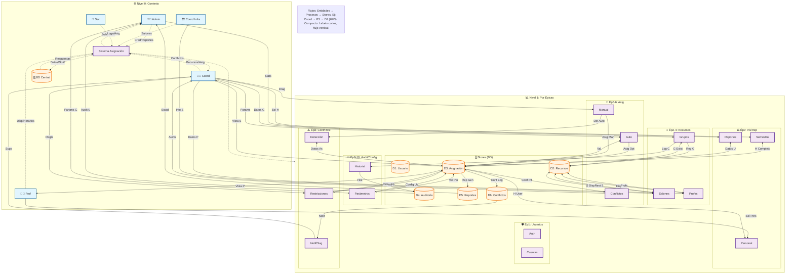

# Diagrama de Flujo de Datos (DFD): Sistema de Asignación de Salones
## Descripción General
DFD que modela flujos de datos por épicas/HU: entidades externas (roles), procesos (funcionalidades), flujos etiquetados y stores (BD). Nivel 0: Contexto global. Nivel 1: Descompuesto. Cubre backlog completo (Épicas 1-10, HU1-19). Visual: Subgraphs agrupados, emojis, colores (azul: entidades, morado: procesos, naranja: stores), flujo vertical.
## Descripciones Detalladas

- Entidades: Roles como fuentes (ej: Coordinador envía "Datos Grupo").
- Procesos: Por épica (ej: P6: Asignación Auto valida disponibilidades).
- Flujos: Etiquetas clave (ej: "Conflicto Log" → D6).
- Stores: Tablas BD (ej: D3: ASIGNACION_BD).
- Cumplimiento: Flujos trazan a HU (ej: P12 para HU16 conflictos/notificaciones).

### Diagrama Mermaid (Nivel 0 y 1)

