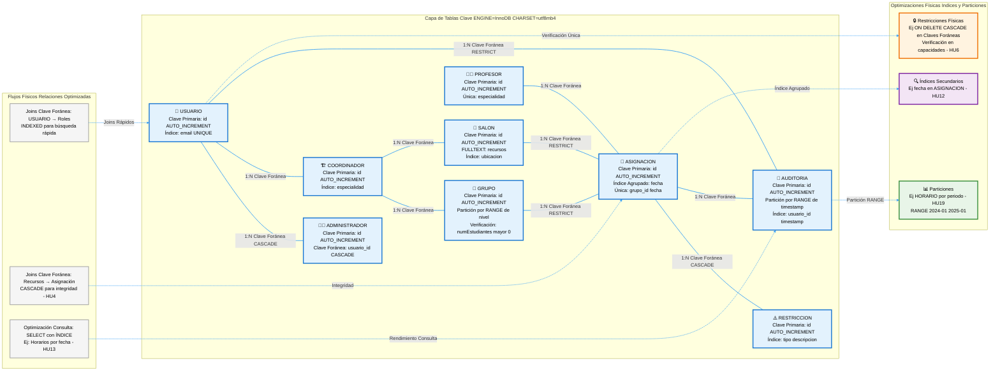

# Diagrama del Modelo Físico: Sistema de Asignación de Salones
## Descripción General
El **Modelo Físico** representa la implementación concreta de la BD en MySQL InnoDB, con detalles de almacenamiento (motores, particiones, índices compuestos, claves candidatas, optimizaciones). 

Deriva del relacional, enfocándose en eficiencia (ej: clustering por fecha para HU13). 

Diferencia: Técnico para rendimiento (ej: PARTITION BY RANGE en AUDITORIA para HU18 logs grandes).
**Atractivo Visual:** Graph LR horizontal, subgraphs temáticos, emojis, colores (azul: tablas, morado: índices, verde: particiones), flechas para relaciones físicas.
## Descripciones Detalladas

- **Tablas**: ENGINE=InnoDB, CHARSET=utf8mb4, detalles físicos (ej: AUTO_INCREMENT PK).
- **Índices**: Clustered/secondary para queries (ej: fecha en ASIGNACION HU12).
- **Particiones**: Por fecha/nivel (ej: HORARIO by periodo HU19).
- **Relaciones Físicas**: FK con ON DELETE, optimizaciones (ej: INDEXED FK).
- **Cumplimiento**: Optimizado para épicas (ej: FULLTEXT en RESTRICCION para HU17 búsquedas).

## Diagrama Mermaid (Modelo Físico - Corregido)

