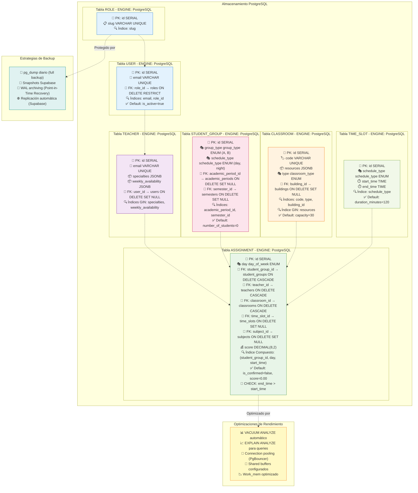

# Diagrama del Modelo Físico: Sistema de Asignación de Salones

## Descripción General
El **Modelo Físico** documenta la implementación concreta en **PostgreSQL** (producción/Supabase) y **SQLite** (desarrollo local), incluyendo optimizaciones de almacenamiento, índices, tipos de datos nativos y estrategias de rendimiento.

**Diferencias clave con documentación anterior:**
- ❌ **Eliminado**: MySQL InnoDB, particiones RANGE, triggers, índices FULLTEXT, vistas materializadas
- ✅ **Actualizado**: PostgreSQL con JSONB, ENUMs nativos, índices B-tree/GIN, constraints modernos
- ✅ **Realidad**: 8 roles en tabla unificada (no 10 tablas separadas)

## Características PostgreSQL Utilizadas

### Tipos de Datos Nativos
- **SERIAL**: Auto-incremento para PKs (equivalente a INTEGER + sequence)
- **VARCHAR(n)**: Strings de longitud variable con límite
- **TEXT**: Strings ilimitados (descripción, curriculum, notes)
- **BOOLEAN**: true/false (is_active, is_confirmed, temporary_access)
- **TIMESTAMP**: Fechas con hora (created_at, updated_at, access_expires_at)
- **DATE**: Solo fecha (start_date, end_date en academic_periods)
- **TIME**: Solo hora (start_time, end_time en time_slots/assignments/availabilities)
- **DECIMAL(p,s)**: Números decimales precisos (score DECIMAL(8,2))
- **JSONB**: JSON binario indexable (resources, specialties, weekly_availability)
- **ENUM personalizado**: Tipos enumerados creados con CREATE TYPE

### Índices y Optimizaciones

#### Índices B-tree (predeterminados)
Usados para búsquedas exactas y rangos en columnas escalares:
```sql
CREATE INDEX idx_users_email ON users(email);                    -- Login rápido
CREATE INDEX idx_users_role_id ON users(role_id);                -- Filtro por rol
CREATE INDEX idx_teachers_email ON teachers(email);              -- Búsqueda de profesor
CREATE INDEX idx_classrooms_code ON classrooms(code);            -- Identificación de salón
CREATE INDEX idx_roles_slug ON roles(slug);                      -- Validación de permisos
```

#### Índices Compuestos
Para queries con múltiples condiciones (detección de conflictos):
```sql
CREATE INDEX idx_assignments_conflict_detection 
    ON assignments(student_group_id, day, start_time);           -- Conflictos de horario
CREATE INDEX idx_assignments_teacher_day 
    ON assignments(teacher_id, day, start_time);                 -- Carga del profesor
CREATE INDEX idx_assignments_classroom_day 
    ON assignments(classroom_id, day, start_time);               -- Disponibilidad de salón
```

#### Índices GIN (para JSONB)
Permiten búsquedas eficientes en columnas JSON:
```sql
CREATE INDEX idx_classrooms_resources_gin 
    ON classrooms USING GIN (resources);                         -- Búsqueda en resources JSON
CREATE INDEX idx_teachers_specialties_gin 
    ON teachers USING GIN (specialties);                         -- Búsqueda en specialties array
```

#### Índices Parciales
Solo indexan filas que cumplen condición (reduce tamaño):
```sql
CREATE INDEX idx_users_active 
    ON users(role_id) WHERE is_active = true;                    -- Solo usuarios activos
CREATE INDEX idx_classrooms_available 
    ON classrooms(type, capacity) WHERE is_active = true;        -- Solo salones disponibles
```

### Constraints y Reglas de Integridad

#### Foreign Keys con Acciones
```sql
-- CASCADE: Eliminar asignaciones cuando se elimina el recurso
ALTER TABLE assignments 
    ADD CONSTRAINT fk_assignment_student_group 
    FOREIGN KEY (student_group_id) REFERENCES student_groups(id) ON DELETE CASCADE;

ALTER TABLE assignments 
    ADD CONSTRAINT fk_assignment_teacher 
    FOREIGN KEY (teacher_id) REFERENCES teachers(id) ON DELETE CASCADE;

ALTER TABLE assignments 
    ADD CONSTRAINT fk_assignment_classroom 
    FOREIGN KEY (classroom_id) REFERENCES classrooms(id) ON DELETE CASCADE;

-- SET NULL: Mantener asignación pero eliminar referencia opcional
ALTER TABLE assignments 
    ADD CONSTRAINT fk_assignment_time_slot 
    FOREIGN KEY (time_slot_id) REFERENCES time_slots(id) ON DELETE SET NULL;

-- RESTRICT: No permitir eliminación si hay referencias
ALTER TABLE users 
    ADD CONSTRAINT fk_user_role 
    FOREIGN KEY (role_id) REFERENCES roles(id) ON DELETE RESTRICT;
```

#### CHECK Constraints
```sql
ALTER TABLE assignments 
    ADD CONSTRAINT check_assignment_times 
    CHECK (end_time > start_time);

ALTER TABLE classrooms 
    ADD CONSTRAINT check_classroom_capacity 
    CHECK (capacity > 0 AND capacity <= 500);

ALTER TABLE assignment_rules 
    ADD CONSTRAINT check_rule_weight 
    CHECK (weight >= 0 AND weight <= 10);

ALTER TABLE student_groups 
    ADD CONSTRAINT check_group_students 
    CHECK (number_of_students >= 0);
```

#### UNIQUE Constraints
```sql
ALTER TABLE users ADD CONSTRAINT unique_users_email UNIQUE (email);
ALTER TABLE teachers ADD CONSTRAINT unique_teachers_email UNIQUE (email);
ALTER TABLE classrooms ADD CONSTRAINT unique_classrooms_code UNIQUE (code);
ALTER TABLE roles ADD CONSTRAINT unique_roles_slug UNIQUE (slug);
```

### ENUMs Personalizados PostgreSQL

```sql
-- Días de la semana
CREATE TYPE day_of_week AS ENUM (
    'monday', 'tuesday', 'wednesday', 'thursday', 'friday', 'saturday'
);

-- Tipo de horario (diurno/nocturno)
CREATE TYPE schedule_type AS ENUM ('day', 'night');

-- Tipo de grupo (A/B)
CREATE TYPE group_type AS ENUM ('A', 'B');

-- Tipo de salón
CREATE TYPE classroom_type AS ENUM (
    'aula', 'laboratorio', 'auditorio', 'sala_reuniones', 'taller'
);

-- Tipo de disponibilidad de salón
CREATE TYPE availability_type AS ENUM (
    'regular', 'maintenance', 'reserved', 'special_event'
);

-- Parámetros de reglas de asignación
CREATE TYPE assignment_parameter AS ENUM (
    'capacity', 'teacher_availability', 'classroom_availability', 
    'resources', 'proximity'
);
```

Uso en tablas:
```sql
CREATE TABLE assignments (
    -- ... otros campos
    day day_of_week NOT NULL,
    -- ...
);

CREATE TABLE time_slots (
    -- ... otros campos
    schedule_type schedule_type NOT NULL,
    -- ...
);
```

## Diagrama Mermaid (Modelo Físico PostgreSQL)



## Comparación: PostgreSQL vs SQLite (Desarrollo Local)

| Característica | PostgreSQL (Prod) | SQLite (Dev Local) |
|---------------|-------------------|---------------------|
| **ENUMs** | Nativos (CREATE TYPE) | Simulados con CHECK constraints |
| **JSONB** | Nativo indexable (GIN) | JSON sin índices especializados |
| **Índices Parciales** | Soportados | Soportados |
| **FK Actions** | CASCADE/RESTRICT/SET NULL | Soportados (desde v3.6.19) |
| **SERIAL** | Nativo | AUTOINCREMENT |
| **TIMESTAMP** | Con zona horaria | Sin zona horaria |
| **Constraints** | CHECK, UNIQUE, FK | CHECK, UNIQUE, FK |
| **Performance** | Alto volumen | Baja concurrencia |

### Ejemplo SQLite (Desarrollo)

```sql
-- SQLite no tiene ENUMs, usa CHECK constraints
CREATE TABLE assignments (
    id INTEGER PRIMARY KEY AUTOINCREMENT,
    day TEXT CHECK(day IN ('monday', 'tuesday', 'wednesday', 'thursday', 'friday', 'saturday')),
    start_time TEXT,  -- Almacena como '08:00:00'
    end_time TEXT,
    score REAL,       -- SQLite no tiene DECIMAL, usa REAL
    resources TEXT,   -- JSON como string, no indexable eficientemente
    -- ... otros campos
    CHECK (end_time > start_time)
);
```

## Estadísticas y Mantenimiento

### VACUUM y ANALYZE
PostgreSQL acumula "espacio muerto" después de UPDATEs/DELETEs. Se requiere limpieza:

```sql
-- Manual (desarrollo)
VACUUM ANALYZE assignments;
VACUUM ANALYZE teachers;

-- Automático (producción - ya configurado en Supabase)
-- autovacuum_vacuum_threshold, autovacuum_analyze_threshold
```

### Estadísticas de Tablas
Monitorear tamaño y uso:

```sql
-- Ver tamaño de tablas
SELECT 
    schemaname,
    tablename,
    pg_size_pretty(pg_total_relation_size(schemaname||'.'||tablename)) AS size
FROM pg_tables
WHERE schemaname = 'public'
ORDER BY pg_total_relation_size(schemaname||'.'||tablename) DESC;

-- Ver índices más grandes
SELECT 
    tablename,
    indexname,
    pg_size_pretty(pg_relation_size(indexrelid)) AS size
FROM pg_indexes
WHERE schemaname = 'public'
ORDER BY pg_relation_size(indexrelid) DESC;
```

### EXPLAIN ANALYZE (Optimización de Queries)

```sql
-- Ver plan de ejecución para detectar conflictos
EXPLAIN ANALYZE
SELECT a1.* 
FROM assignments a1
WHERE a1.student_group_id = 5
  AND a1.day = 'monday'
  AND a1.start_time <= '10:00'
  AND a1.end_time >= '08:00';
-- Debe usar idx_assignments_conflict_detection (Index Scan)
-- Si usa Seq Scan, crear índice faltante
```

## Configuración PostgreSQL Recomendada (Supabase)

```conf
# Memoria
shared_buffers = 256MB           # Cache de datos en RAM
work_mem = 16MB                  # Memoria por operación de sort/hash
maintenance_work_mem = 128MB     # Para VACUUM, CREATE INDEX

# Conexiones
max_connections = 100            # Límite de conexiones simultáneas
                                # (Supabase usa PgBouncer con pooling)

# WAL (Write-Ahead Logging)
wal_level = replica              # Para replicación
archive_mode = on                # Backup continuo
max_wal_senders = 3              # Réplicas de lectura

# Autovacuum (limpieza automática)
autovacuum = on
autovacuum_max_workers = 3
autovacuum_naptime = 1min
```

## Notas Finales

### Diferencias con Documentación Anterior
- **❌ Eliminado**: Optimizaciones MySQL (FULLTEXT, PARTITION BY RANGE, ENGINE=InnoDB)
- **❌ Eliminado**: Triggers para auditoría (se hace en Laravel con Observers)
- **❌ Eliminado**: Vistas materializadas (queries dinámicas vía Eloquent)
- **✅ Agregado**: Índices GIN para JSONB, ENUMs nativos, índices parciales
- **✅ Corregido**: 8 roles en tabla unificada (no 10 tablas ADMINISTRADOR/COORDINADOR_ACADEMICO/etc.)

### Flujo de Datos Físico
1. **Conexión**: App Laravel → PgBouncer (pool) → PostgreSQL
2. **Escritura**: INSERT/UPDATE → WAL → Shared buffers → Disco
3. **Lectura**: Query → Índices B-tree/GIN → Cache → Resultado
4. **Backup**: WAL archiving → Supabase snapshots → S3

### Herramientas de Monitoreo
- **Supabase Dashboard**: Métricas en tiempo real (CPU, memoria, queries lentas)
- **pg_stat_statements**: Top queries más costosas
- **pgAdmin**: Administración visual de BD
- **Laravel Telescope**: Queries ejecutadas por request (desarrollo)
