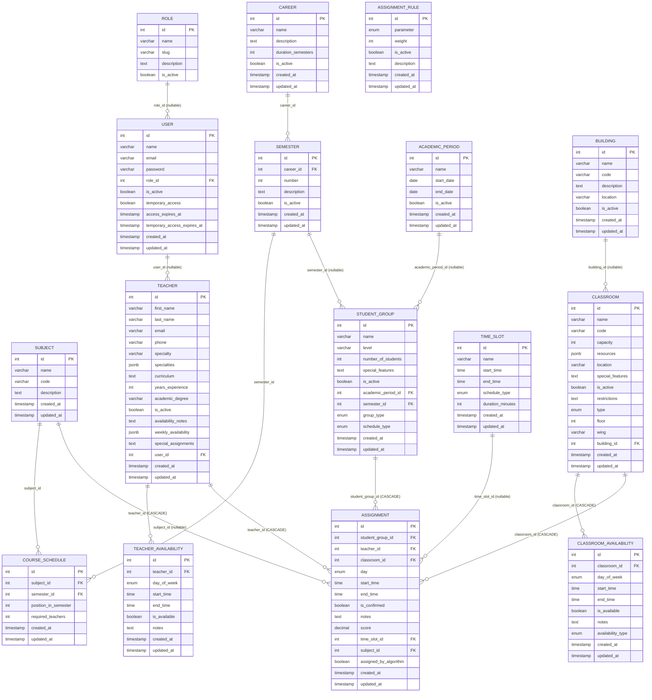

# Diagrama de Modelo Relacional: Sistema de Asignación de Salones

## Descripción General
El **Modelo Relacional** representa la implementación en base de datos del ERD, mostrando tablas con tipos de datos específicos, claves primarias (PK), claves foráneas (FK) e índices. Este diagrama refleja la **arquitectura real Laravel** con PostgreSQL/SQLite.

**Características clave:**
- **Normalización 3NF**: Elimina redundancias (roles en tabla separada, no atributo enum en users)
- **8 roles reales**: Almacenados en tabla `roles`, asignados vía `users.role_id`
- **Tipos PostgreSQL**: JSON/JSONB, ENUM, TIME, DECIMAL, BOOLEAN
- **Constraints**: UNIQUE, NOT NULL, DEFAULT, CHECK, CASCADE/RESTRICT en FKs
- **Índices estratégicos**: Para búsquedas frecuentes (email, códigos, fechas)

## Diferencias con Documentación Anterior
- **❌ Eliminado**: 10 tablas de roles (ADMINISTRADOR, SUPERADMINISTRADOR, COORDINADOR_ACADEMICO, etc.)
- **✅ Modelo real**: `users.role_id` FK a `roles` (8 filas)
- **❌ Eliminado**: HORARIO, REPORTE, PARAMETRO, AUDITORIA (no implementadas en migraciones actuales)
- **✅ Agregado**: CAREER, SEMESTER, SUBJECT, COURSE_SCHEDULE, ACADEMIC_PERIOD, BUILDING, TIME_SLOT, TEACHER_AVAILABILITY, CLASSROOM_AVAILABILITY, ASSIGNMENT_RULE

## Diagrama Mermaid (Modelo Relacional Real)


## Especificaciones de Implementación

### Constraints por Tabla

#### ROLE
- **PK**: `id` (auto-increment)
- **UNIQUE**: `slug` (administrador, coordinador, profesor, etc.)
- **CHECK**: `is_active` IN (true, false)
- **Índices**: `slug` para validación de permisos

#### USER
- **PK**: `id` (auto-increment)
- **UNIQUE**: `email`
- **FK**: `role_id` REFERENCES `roles(id)` ON DELETE RESTRICT (nullable)
- **DEFAULT**: `is_active` = true, `temporary_access` = false
- **Índices**: `email` (UNIQUE), `role_id`

#### TEACHER
- **PK**: `id` (auto-increment)
- **UNIQUE**: `email`
- **FK**: `user_id` REFERENCES `users(id)` ON DELETE SET NULL (nullable)
- **JSON**: `specialties` (array de especialidades), `weekly_availability` (horarios semanales)
- **DEFAULT**: `is_active` = true
- **Índices**: `email` (UNIQUE), `user_id`

#### STUDENT_GROUP
- **PK**: `id` (auto-increment)
- **FK**: 
  - `academic_period_id` REFERENCES `academic_periods(id)` ON DELETE SET NULL (nullable)
  - `semester_id` REFERENCES `semesters(id)` ON DELETE SET NULL (nullable)
- **ENUM**: 
  - `group_type`: 'A', 'B'
  - `schedule_type`: 'day', 'night'
- **DEFAULT**: `is_active` = true, `number_of_students` = 0
- **Índices**: `academic_period_id`, `semester_id`

#### CLASSROOM
- **PK**: `id` (auto-increment)
- **UNIQUE**: `code`
- **FK**: `building_id` REFERENCES `buildings(id)` ON DELETE SET NULL (nullable)
- **JSON**: `resources` (proyector, computadoras, etc.)
- **ENUM**: `type`: 'aula', 'laboratorio', 'auditorio', 'sala_reuniones', 'taller'
- **DEFAULT**: `capacity` = 30, `is_active` = true
- **Índices**: `code` (UNIQUE), `building_id`, `type`

#### ASSIGNMENT
- **PK**: `id` (auto-increment)
- **FK** (CASCADE):
  - `student_group_id` REFERENCES `student_groups(id)` ON DELETE CASCADE
  - `teacher_id` REFERENCES `teachers(id)` ON DELETE CASCADE
  - `classroom_id` REFERENCES `classrooms(id)` ON DELETE CASCADE
- **FK** (nullable):
  - `time_slot_id` REFERENCES `time_slots(id)` ON DELETE SET NULL
  - `subject_id` REFERENCES `subjects(id)` ON DELETE SET NULL
- **ENUM**: `day`: 'monday', 'tuesday', 'wednesday', 'thursday', 'friday', 'saturday'
- **DECIMAL**: `score` (8,2) - Puntuación del algoritmo de asignación
- **DEFAULT**: `is_confirmed` = false, `score` = 0.00, `assigned_by_algorithm` = false
- **Índices**: Compuesto `(student_group_id, day, start_time)` para detección de conflictos
- **CHECK**: `end_time` > `start_time`

#### TIME_SLOT
- **PK**: `id` (auto-increment)
- **ENUM**: `schedule_type`: 'day', 'night'
- **DEFAULT**: `duration_minutes` = 120
- **Índices**: `schedule_type`

#### ASSIGNMENT_RULE
- **PK**: `id` (auto-increment)
- **ENUM**: `parameter`: 'capacity', 'teacher_availability', 'classroom_availability', 'resources', 'proximity'
- **DEFAULT**: `is_active` = true, `weight` = 1
- **CHECK**: `weight` >= 0 AND `weight` <= 10

### Tipos de Datos PostgreSQL Utilizados

- **INTEGER**: IDs, contadores (years_experience, number_of_students, capacity, weight)
- **VARCHAR**: Nombres cortos (name, email, code, slug)
- **TEXT**: Contenido largo (description, curriculum, notes, special_features)
- **BOOLEAN**: Flags (is_active, is_confirmed, is_available, temporary_access, assigned_by_algorithm)
- **TIMESTAMP**: Auditoría (created_at, updated_at, access_expires_at)
- **DATE**: Fechas simples (start_date, end_date en academic_periods)
- **TIME**: Horas del día (start_time, end_time en time_slots/availabilities/assignments)
- **DECIMAL(8,2)**: Números con decimales (score)
- **JSONB**: Datos estructurados flexibles (resources, specialties, weekly_availability)
- **ENUM**: Valores predefinidos (day_of_week, schedule_type, group_type, classroom_type, availability_type, day)

### Índices Estratégicos

```sql
CREATE INDEX idx_users_email ON users(email);
CREATE INDEX idx_users_role_id ON users(role_id);
CREATE INDEX idx_teachers_email ON teachers(email);
CREATE INDEX idx_teachers_user_id ON teachers(user_id);
CREATE INDEX idx_classrooms_code ON classrooms(code);
CREATE INDEX idx_classrooms_building_id ON classrooms(building_id);
CREATE INDEX idx_classrooms_type ON classrooms(type);
CREATE INDEX idx_assignments_student_group_day_time ON assignments(student_group_id, day, start_time);
CREATE INDEX idx_assignments_teacher_id ON assignments(teacher_id);
CREATE INDEX idx_assignments_classroom_id ON assignments(classroom_id);
CREATE INDEX idx_assignments_time_slot_id ON assignments(time_slot_id);
CREATE INDEX idx_time_slots_schedule_type ON time_slots(schedule_type);
CREATE INDEX idx_student_groups_academic_period_id ON student_groups(academic_period_id);
CREATE INDEX idx_student_groups_semester_id ON student_groups(semester_id);
```

### Triggers y Vistas (No Implementados)

A diferencia de documentación anterior que mencionaba triggers/vistas materializadas en MySQL, el sistema Laravel actual **no utiliza**:
- ❌ Triggers para auditoría (se hace vía middleware/observers Laravel)
- ❌ Vistas materializadas (queries dinámicas vía Eloquent)
- ❌ Particiones por fecha (volumen de datos no lo requiere)
- ❌ Stored procedures (lógica en capa de aplicación)

### Script SQL de Ejemplo (PostgreSQL)

```sql
-- Crear tabla roles (simplificada, real usa migrations)
CREATE TABLE roles (
    id SERIAL PRIMARY KEY,
    name VARCHAR(255) NOT NULL,
    slug VARCHAR(255) UNIQUE NOT NULL,
    description TEXT,
    is_active BOOLEAN DEFAULT true,
    created_at TIMESTAMP,
    updated_at TIMESTAMP
);

-- Crear tabla users con FK a roles
CREATE TABLE users (
    id SERIAL PRIMARY KEY,
    name VARCHAR(255) NOT NULL,
    email VARCHAR(255) UNIQUE NOT NULL,
    password VARCHAR(255) NOT NULL,
    role_id INTEGER REFERENCES roles(id) ON DELETE RESTRICT,
    is_active BOOLEAN DEFAULT true,
    temporary_access BOOLEAN DEFAULT false,
    access_expires_at TIMESTAMP,
    temporary_access_expires_at TIMESTAMP,
    created_at TIMESTAMP,
    updated_at TIMESTAMP
);

-- Crear tabla teachers con JSON
CREATE TABLE teachers (
    id SERIAL PRIMARY KEY,
    first_name VARCHAR(255) NOT NULL,
    last_name VARCHAR(255) NOT NULL,
    email VARCHAR(255) UNIQUE NOT NULL,
    phone VARCHAR(255),
    specialty VARCHAR(255),
    specialties JSONB,
    curriculum TEXT,
    years_experience INTEGER,
    academic_degree VARCHAR(255),
    is_active BOOLEAN DEFAULT true,
    availability_notes TEXT,
    weekly_availability JSONB,
    special_assignments TEXT,
    user_id INTEGER REFERENCES users(id) ON DELETE SET NULL,
    created_at TIMESTAMP,
    updated_at TIMESTAMP
);

-- Crear tabla assignments con ENUM y constraints
CREATE TABLE assignments (
    id SERIAL PRIMARY KEY,
    student_group_id INTEGER NOT NULL REFERENCES student_groups(id) ON DELETE CASCADE,
    teacher_id INTEGER NOT NULL REFERENCES teachers(id) ON DELETE CASCADE,
    classroom_id INTEGER NOT NULL REFERENCES classrooms(id) ON DELETE CASCADE,
    day VARCHAR(20) CHECK (day IN ('monday', 'tuesday', 'wednesday', 'thursday', 'friday', 'saturday')),
    start_time TIME NOT NULL,
    end_time TIME NOT NULL,
    is_confirmed BOOLEAN DEFAULT false,
    notes TEXT,
    score DECIMAL(8,2) DEFAULT 0.00,
    time_slot_id INTEGER REFERENCES time_slots(id) ON DELETE SET NULL,
    subject_id INTEGER REFERENCES subjects(id) ON DELETE SET NULL,
    assigned_by_algorithm BOOLEAN DEFAULT false,
    created_at TIMESTAMP,
    updated_at TIMESTAMP,
    CHECK (end_time > start_time)
);

CREATE INDEX idx_assignments_conflicts ON assignments(student_group_id, day, start_time);
```

## Notas Finales

- **Migraciones**: Usar `php artisan migrate --seed` para crear estructura completa
- **Seeders**: `RoleSeeder` crea los 8 roles, otros seeders generan datos de prueba
- **ORM**: Eloquent gestiona relaciones (hasMany, belongsTo, belongsToMany)
- **Validaciones**: En FormRequests Laravel, no constraints DB complejos
- **Soft Deletes**: No implementado (usar `is_active` para desactivar recursos)
