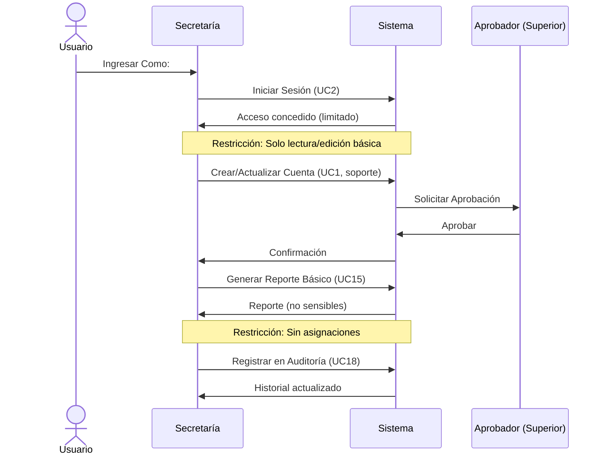
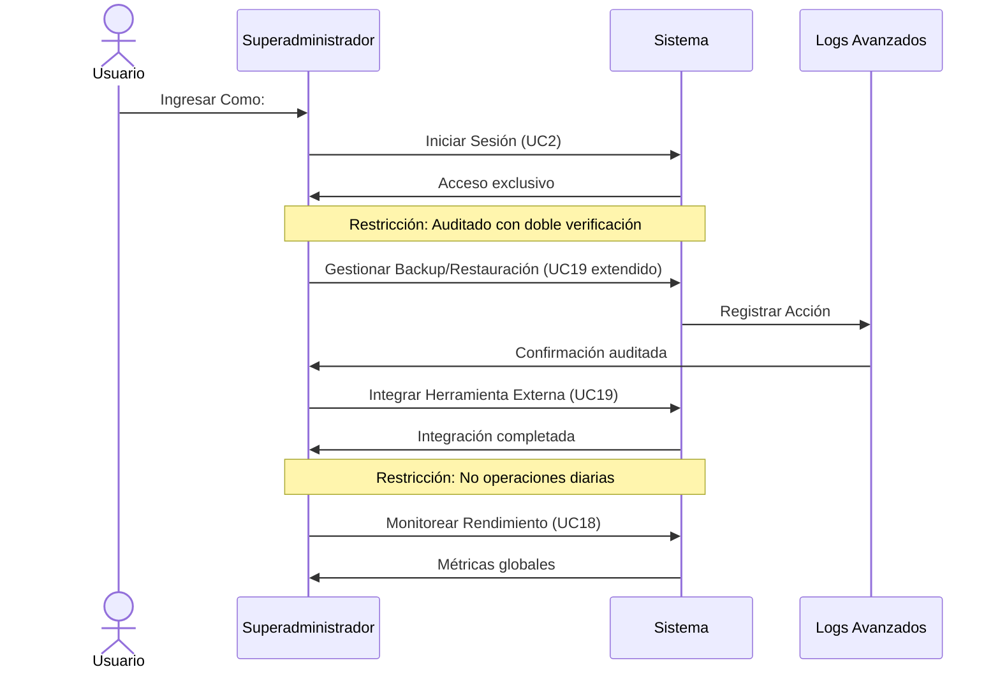
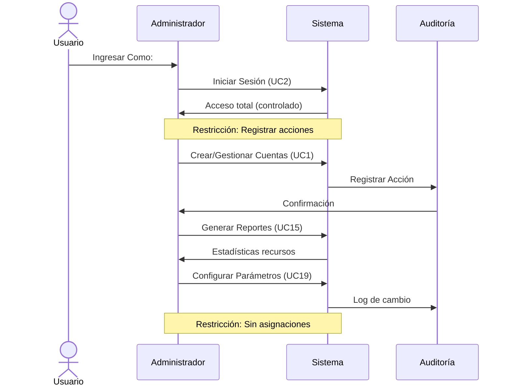
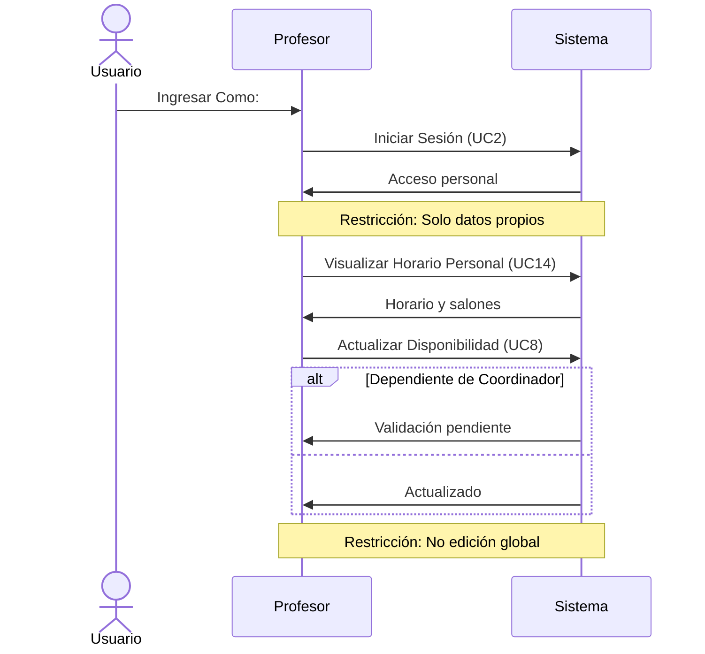
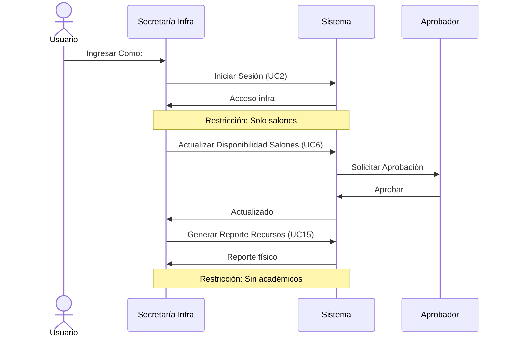
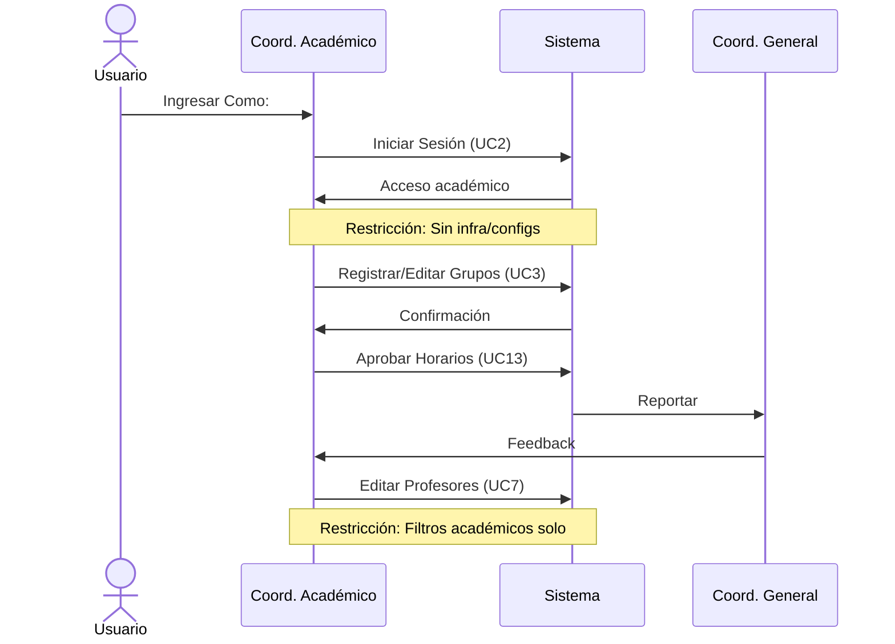
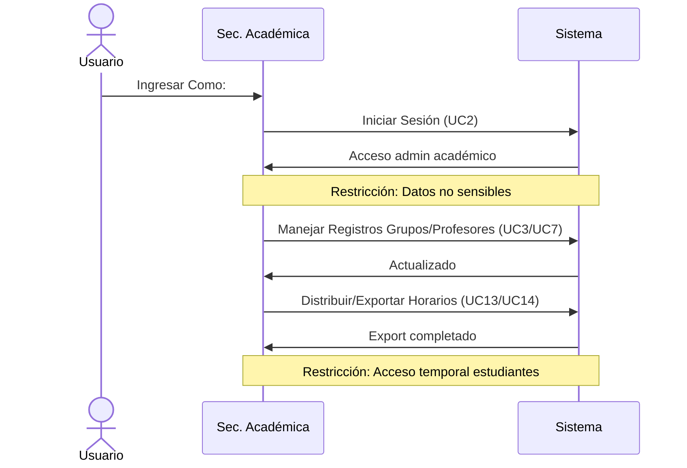
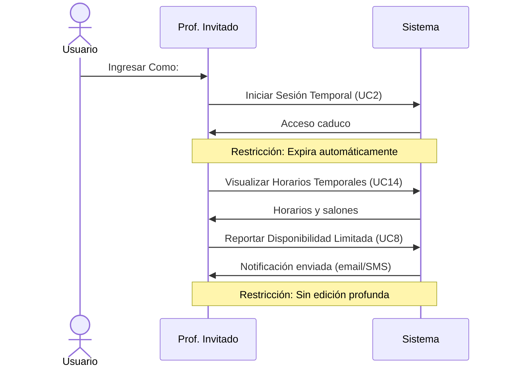
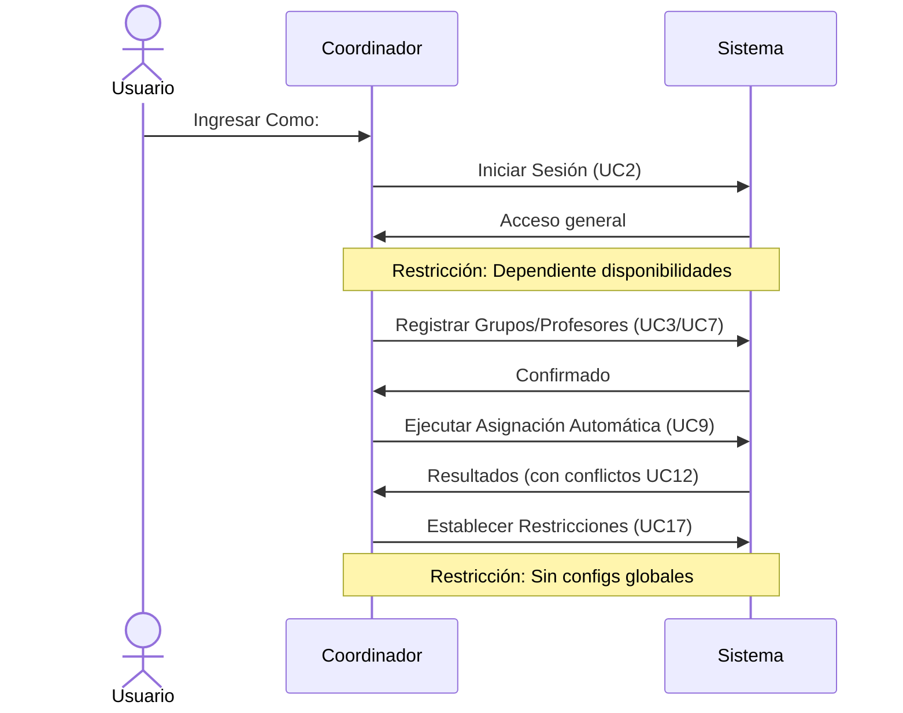
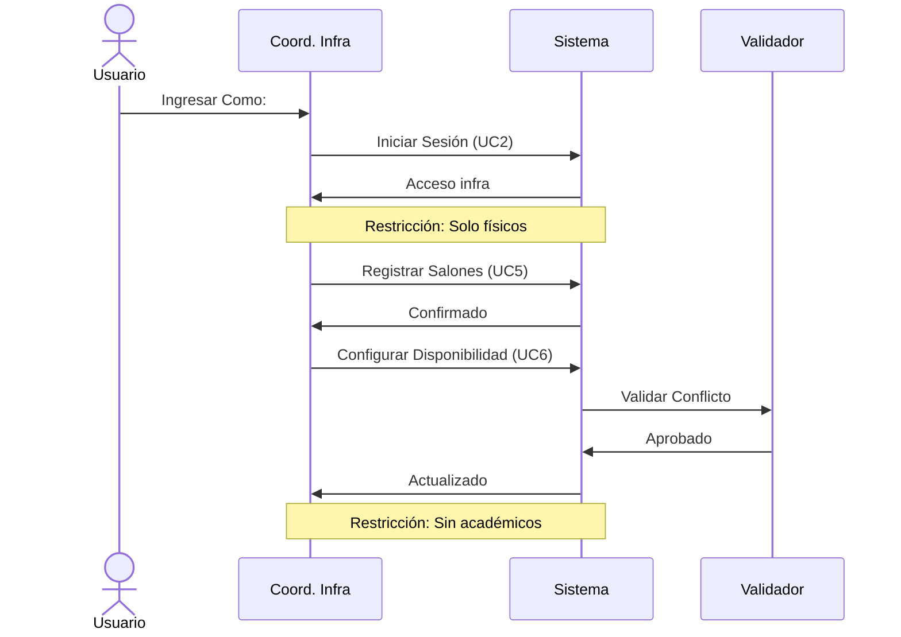

# Diagramas de Secuencia para Casos de Uso por Rol

## Introducción
Estos diagramas de secuencia ilustran las interacciones clave de cada rol con el sistema, enfocándose en sus **actividades principales** y **restricciones específicas**. Cada diagrama usa sintaxis Mermaid para renderizarse en GitHub. Las restricciones se representan como notas o guards (condiciones) en las flechas. Todos los roles inician con autenticación (UC2), como se detalló previamente.

### 1. Secretaría (General)

- **Actividades Principales**: Apoya en creación de cuentas, gestiona solicitudes de cambios en horarios, genera/distribuye reportes básicos y mantiene auditoría rutinaria.  

- **Restricciones Específicas**: Acceso limitado a lectura/edición básica (no asignaciones ni configs globales). Depende de aprobaciones superiores. Solo visualiza datos no sensibles.

### 2. Superadministrador

- **Actividades Principales**: Gestiona backups/restauraciones, integra con herramientas externas (ej: LMS), monitorea rendimiento global y aprueba cambios estructurales.

- **Restricciones Específicas**: Acceso exclusivo y auditado (solo para IT/directivos). No interfiere en operaciones diarias. Requiere logs avanzados con doble verificación.

### 3. Administrador

- **Actividades Principales**: Crea/gestiona cuentas, genera reportes de recursos/estadísticas, visualiza historial/auditoría y configura parámetros generales (períodos, días laborables).

- **Restricciones Específicas**: Acceso total pero controlado por rol (no ejecución de asignaciones). Debe registrar todas las acciones para auditoría.

### 4. Profesor

- **Actividades Principales**: Inicia sesión, visualiza horario personal y salones asignados, actualiza su disponibilidad horaria y preferencias.

- **Restricciones Específicas**: Acceso solo a datos personales (no edición global). Dependiente de asignaciones de coordinadores; no ve horarios ajenos.

### 5. Secretaría de Infraestructura

- **Actividades Principales**: Actualiza disponibilidades de salones (ej: por mantenimiento), genera reportes de uso de recursos físicos y notifica restricciones.

- **Restricciones Específicas**: Enfocado solo en datos de salones/infraestructura; no accede a horarios académicos o grupos. Requiere aprobación para cambios.

### 6. Coordinador Académico

- **Actividades Principales**: Registra/edita grupos y profesores (enfoque en datos académicos como niveles/especialidades), coordina preferencias pedagógicas y aprueba horarios propuestos.

- **Restricciones Específicas**: No gestiona infraestructura física; reporta a coordinador general. Limitado a filtros académicos, sin configs globales.

### 7. Secretaria Académica

- **Actividades Principales**: Maneja registros administrativos de grupos/profesores, distribuye horarios a estudiantes/familias y exporta a calendarios externos.

- **Restricciones Específicas**: No asigna salones ni edita disponibilidades; solo datos no sensibles. Acceso temporal a info de estudiantes (con privacidad GDPR-like).

### 8. Profesor Invitado

- **Actividades Principales**: Visualiza horarios temporales y salones asignados, reporta disponibilidades limitadas y recibe notificaciones por email/SMS.

- **Restricciones Específicas**: Acceso caduco (expira automáticamente); sin edición profunda ni gestión de recursos. Solo para sesiones puntuales.

### 9. Coordinador (General)

- **Actividades Principales**: Registra/edita grupos/profesores, ejecuta asignaciones automáticas/manuales, visualiza horarios/conflictos y establece restricciones.

- **Restricciones Específicas**: Dependiente de disponibilidades reales; no configs globales (eso es de admin). Acceso amplio pero no ilimitado a datos sensibles.

### 10. Coordinador de Infraestructura

- **Actividades Principales**: Registra/gestiona salones (capacidad, recursos, ubicación) y configura su disponibilidad horaria/restricciones de uso.

- **Restricciones Específicas**: Enfocado solo en recursos físicos; no ve/edita datos académicos. Cambios requieren validación para evitar conflictos.

