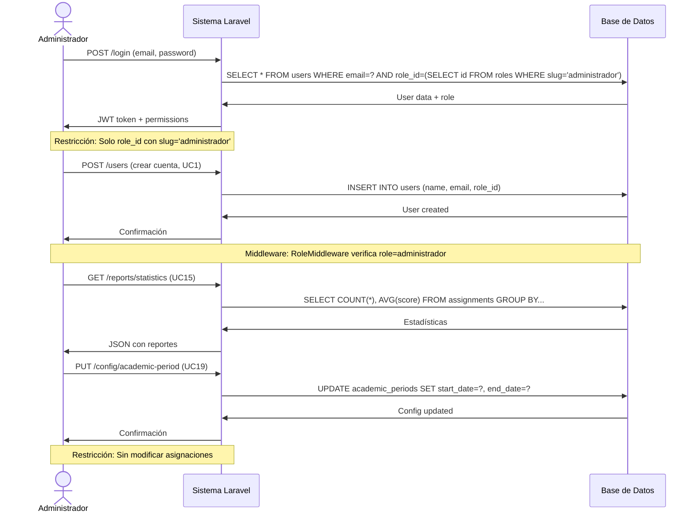
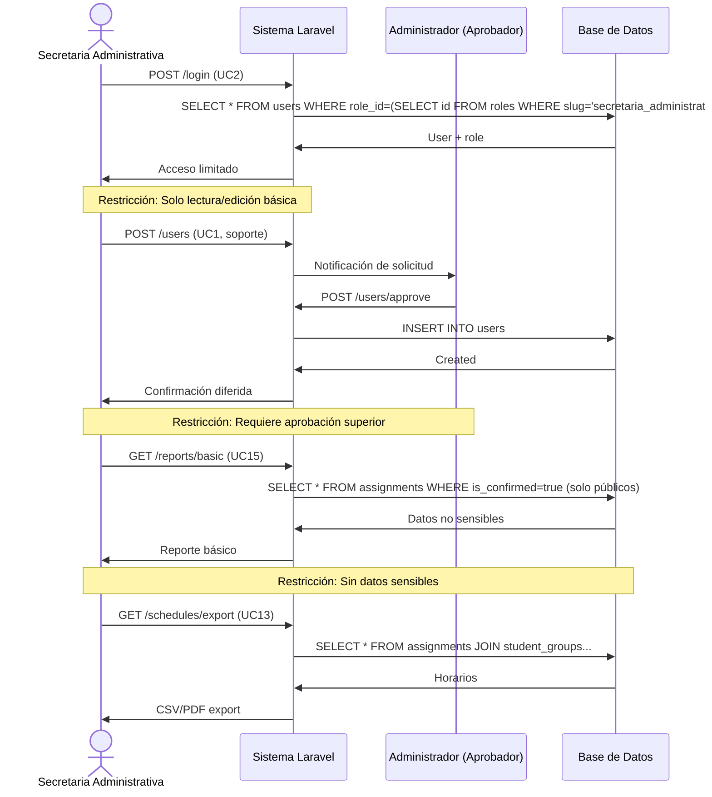
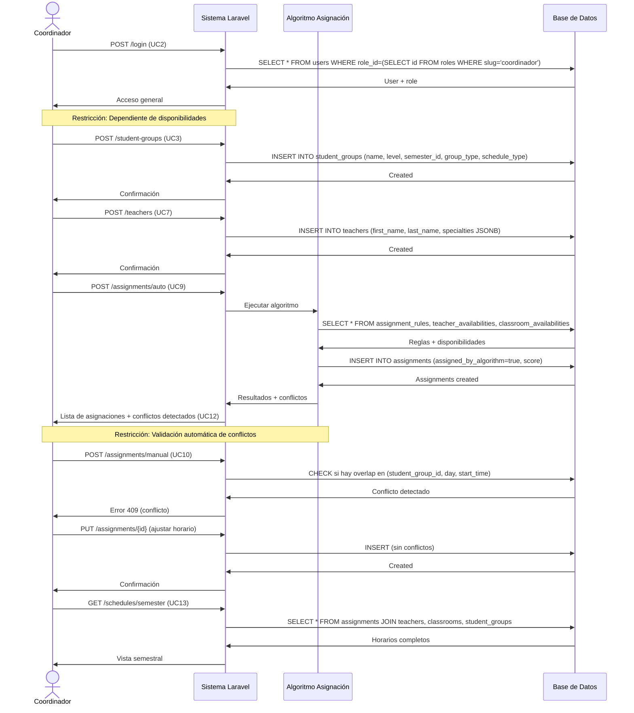
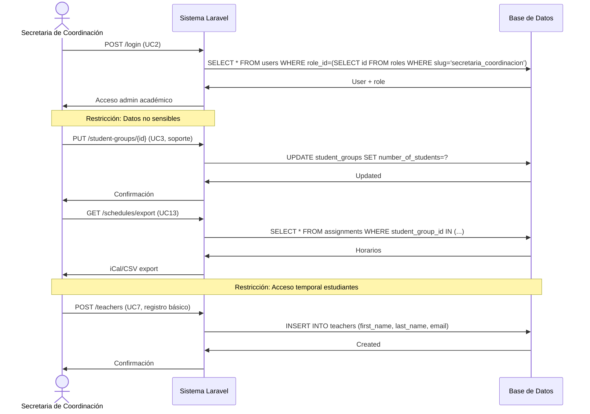
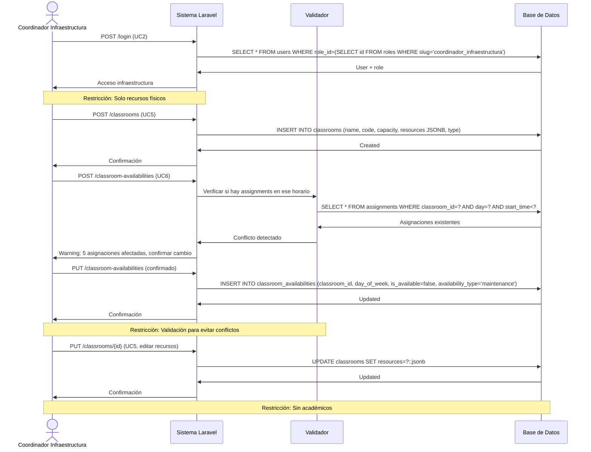
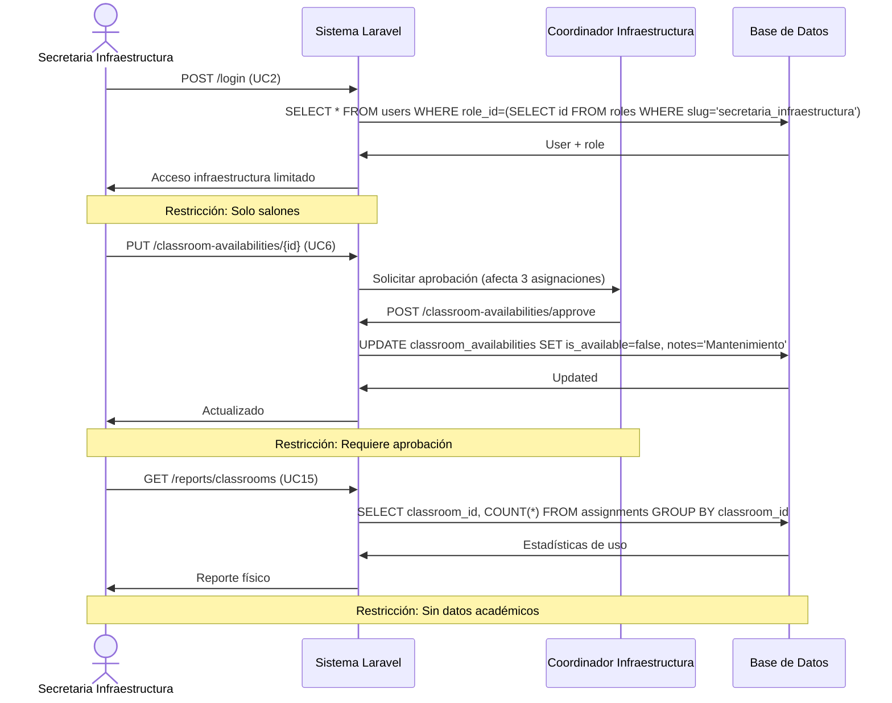
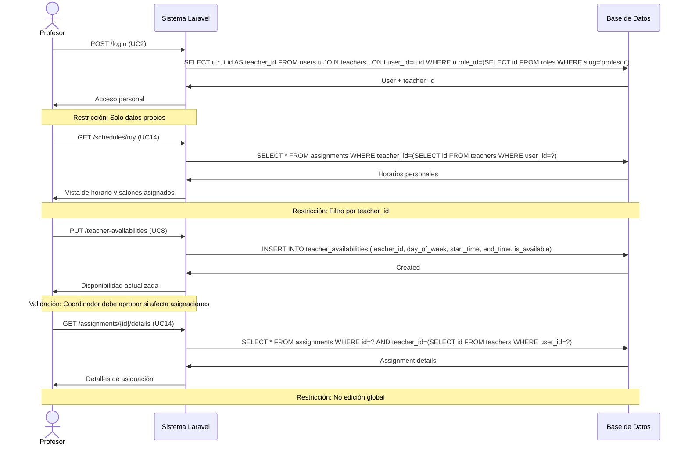
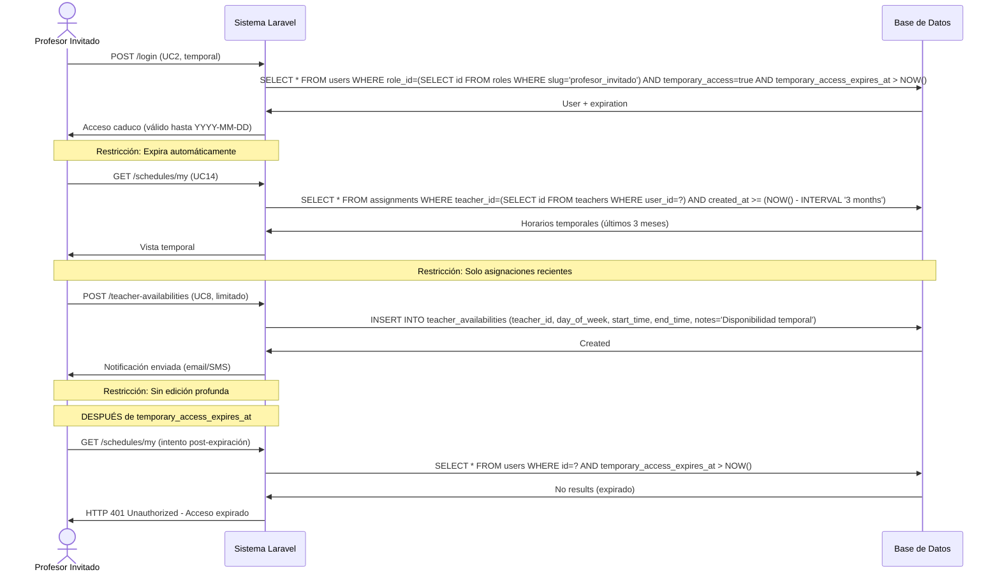

# Diagramas de Secuencia para Casos de Uso por Rol

## Introducción
Estos diagramas de secuencia ilustran las interacciones clave de cada **rol real del sistema** (8 roles del `RoleSeeder.php`) con el backend Laravel. Cada diagrama usa sintaxis Mermaid y refleja las restricciones de permisos implementadas vía `RoleMiddleware`.

**Actualización**: Se eliminaron diagramas para roles ficticios (Superadministrador, CoordinadorAcademico, SecretariaAcademica, SecretariaInfraestructura) que no existen en el proyecto. Los 8 roles reales son:

1. **Administrador** (`administrador`)
2. **Secretaria Administrativa** (`secretaria_administrativa`)
3. **Coordinador** (`coordinador`)
4. **Secretaria de Coordinación** (`secretaria_coordinacion`)
5. **Coordinador de Infraestructura** (`coordinador_infraestructura`)
6. **Secretaria de Infraestructura** (`secretaria_infraestructura`)
7. **Profesor** (`profesor`)
8. **Profesor Invitado** (`profesor_invitado`)

## 1. Administrador

**Actividades Principales**: 
- Crea/gestiona cuentas de usuarios (UC1)
- Genera reportes estadísticos (UC15)
- Configura parámetros generales del sistema (UC19)
- Visualiza historial de auditoría (UC18)

**Restricciones Específicas**: 
- Acceso total pero registrado (todas las acciones se auditan vía middleware)
- No ejecuta asignaciones directamente (eso es del Coordinador)
- Puede ver todos los datos pero no modificar asignaciones confirmadas



## 2. Secretaria Administrativa

**Actividades Principales**:
- Apoya en creación de cuentas básicas (UC1, con aprobación)
- Genera reportes simples (UC15, solo lectura)
- Distribuye horarios a estudiantes/familias (UC13, exportación)

**Restricciones Específicas**:
- Acceso limitado a lectura/edición básica
- No gestiona asignaciones ni configuración global
- Solo visualiza datos no sensibles (sin salarios, evaluaciones personales)



## 3. Coordinador

**Actividades Principales**:
- Registra/edita grupos de estudiantes (UC3)
- Gestiona profesores (UC7) - incluye funciones académicas
- Ejecuta asignación automática (UC9)
- Realiza asignación manual (UC10)
- Visualiza horarios y conflictos (UC12, UC13)
- Establece restricciones (UC17)

**Restricciones Específicas**:
- Dependiente de disponibilidades reales (no puede asignar si hay conflictos)
- No accede a configuración global (eso es del Administrador)
- Acceso amplio a gestión académica pero con validaciones



## 4. Secretaria de Coordinación

**Actividades Principales**:
- Maneja registros administrativos de grupos/profesores (UC3/UC7, soporte)
- Distribuye horarios a estudiantes/familias (UC13)
- Exporta a calendarios externos (UC13)

**Restricciones Específicas**:
- No asigna salones ni edita disponibilidades físicas
- Solo datos académicos no sensibles
- Acceso temporal a info de estudiantes (privacidad)



## 5. Coordinador de Infraestructura

**Actividades Principales**:
- Registra/gestiona salones (UC5) - capacidad, recursos, ubicación
- Configura disponibilidad horaria de salones (UC6)
- Establece restricciones de uso (UC17, físicas)

**Restricciones Específicas**:
- Enfocado solo en recursos físicos (classrooms, buildings)
- No ve/edita datos académicos (grupos, profesores, asignaciones)
- Cambios requieren validación para evitar conflictos con asignaciones existentes



## 6. Secretaria de Infraestructura

**Actividades Principales**:
- Actualiza disponibilidades de salones (UC6, por mantenimiento/eventos)
- Genera reportes de uso de recursos físicos (UC15, infraestructura)
- Notifica restricciones a coordinadores

**Restricciones Específicas**:
- Enfocado solo en datos de salones/infraestructura
- No accede a horarios académicos o grupos
- Requiere aprobación para cambios que afecten asignaciones activas



## 7. Profesor

**Actividades Principales**:
- Inicia sesión (UC2)
- Visualiza horario personal y salones asignados (UC14)
- Actualiza disponibilidad horaria (UC8)
- Reporta preferencias de horarios

**Restricciones Específicas**:
- Acceso solo a datos personales (filtro por `teacher.user_id` o `teacher_id`)
- No edición global de recursos
- Dependiente de asignaciones de coordinadores
- No ve horarios de otros profesores



## 8. Profesor Invitado

**Actividades Principales**:
- Visualiza horarios temporales (UC14, acceso limitado por fecha)
- Reporta disponibilidades limitadas (UC8, temporal)
- Recibe notificaciones por email/SMS

**Restricciones Específicas**:
- Acceso caduco (expira automáticamente vía `temporary_access_expires_at`)
- Sin edición profunda ni gestión de recursos
- Solo para sesiones puntuales (1-2 semestres máximo)
- No puede crear/modificar grupos o salones



## Notas de Implementación

### Middleware de Autorización (RoleMiddleware)
Todas las rutas protegidas usan `RoleMiddleware` que verifica:
```php
// app/Http/Middleware/RoleMiddleware.php
public function handle($request, Closure $next, ...$roles)
{
    if (!auth()->check()) {
        return response()->json(['error' => 'Unauthorized'], 401);
    }
    
    $userRole = auth()->user()->role->slug;
    
    if (!in_array($userRole, $roles)) {
        return response()->json(['error' => 'Forbidden'], 403);
    }
    
    return $next($request);
}
```

### Ejemplo de Rutas con Roles
```php
// routes/web.php
Route::middleware(['auth', 'role:administrador'])->group(function () {
    Route::post('/users', [UserController::class, 'store']); // UC1
    Route::get('/reports/statistics', [ReportController::class, 'statistics']); // UC15
});

Route::middleware(['auth', 'role:coordinador'])->group(function () {
    Route::post('/student-groups', [StudentGroupController::class, 'store']); // UC3
    Route::post('/assignments/auto', [AssignmentController::class, 'auto']); // UC9
    Route::post('/assignments/manual', [AssignmentController::class, 'manual']); // UC10
});

Route::middleware(['auth', 'role:coordinador_infraestructura'])->group(function () {
    Route::post('/classrooms', [ClassroomController::class, 'store']); // UC5
    Route::post('/classroom-availabilities', [ClassroomAvailabilityController::class, 'store']); // UC6
});

Route::middleware(['auth', 'role:profesor,profesor_invitado'])->group(function () {
    Route::get('/schedules/my', [ScheduleController::class, 'personal']); // UC14
});
```

### Validación de Acceso Temporal (Profesor Invitado)
```php
// app/Http/Middleware/CheckTemporaryAccess.php
public function handle($request, Closure $next)
{
    $user = auth()->user();
    
    if ($user->temporary_access && 
        $user->temporary_access_expires_at < now()) {
        auth()->logout();
        return response()->json(['error' => 'Temporary access expired'], 401);
    }
    
    return $next($request);
}
```

## Diferencias con Documentación Anterior

**❌ Eliminado**:
- Diagrama para **Superadministrador** (rol inexistente)
- Diagrama para **Coordinador Académico** (consolidado en Coordinador)
- Diagrama para **Secretaria Académica** (ahora es Secretaria de Coordinación)
- Diagramas separados para subtipos de secretarias (unificados)

**✅ Actualizado**:
- 8 roles reales del `RoleSeeder.php`
- Interacciones con tablas reales (users, roles, teachers, assignments, etc.)
- Restricciones implementadas vía `RoleMiddleware` y policies Laravel
- Validaciones de conflictos vía queries SQL (no triggers)
- Acceso temporal para Profesor Invitado con expiración automática

**✅ Agregado**:
- Flujos para Secretaria de Coordinación (apoyo académico)
- Flujos para Secretaria de Infraestructura (apoyo en salones)
- Validación de disponibilidades antes de asignaciones
- Notificaciones de conflictos al Coordinador
- Aprobaciones para cambios críticos (Secretarias → Administrador/Coordinadores)
