# Diagrama Flujo de Datos
---
## Enfoque para el Diagrama de Flujo de Datos
Un DFD muestra cómo los datos fluyen entre entidades externas, procesos, almacenes de datos, y flujos de datos. Basado en el sistema descrito en el documento, el DFD nivel 0 (diagrama de contexto) y nivel 1 (desglose de procesos principales) cubrirán las funcionalidades clave del sistema de gestión de asignaciones académicas. A continuación, detallo el enfoque:

- Entidades Externas:
	- Administrador: Gestiona usuarios, parámetros del sistema, y auditorías (HU1, HU2, HU19).
	- Coordinador: Configura periodos académicos, grupos, salones, y restricciones; realiza asignaciones manuales (HU3-HU6, HU9-HU12, HU16-HU17).
	- Profesor: Registra disponibilidades y consulta asignaciones (HU7-HU8, HU11).
	- Sistema Externo: Genera reportes de ocupación y detecta conflictos (HU13-HU15).

- Procesos Principales (basados en épicas):
	- Gestión de Usuarios: Autenticación y gestión de roles (HU1-HU2).
	- Gestión de Recursos Académicos: Configuración de periodos, grupos, salones, y profesores (HU3-HU8).
	- Gestión de Asignaciones: Asignaciones automáticas y manuales, validación de restricciones (HU9-HU12, HU16-HU17).
	- Generación de Reportes: Reportes de ocupación y auditorías (HU13-HU15, HU18).
	- Configuración del Sistema: Gestión de parámetros del sistema (HU19).

- Almacenes de Datos:
	- Cada tabla del modelo físico (periodo_academico, usuario, profesor, grupo, salon, recurso, salon_recurso, recurso_disponibilidad, disp_profesor, disp_salon, asignacion, tipo_restriccion, restriccion, auditoria, reporte_ocupacion, parametro_sistema) se representa como un almacén de datos. Las vistas (vista_conflictos_salon, vista_conflictos_profesor) se incluirán como almacenes derivados para reportes de conflictos.

- Flujos de Datos:
	- Representan la información que se mueve entre entidades externas, procesos, y almacenes (e.g., credenciales de usuario, asignaciones propuestas, reportes de ocupación). Basados en las interacciones descritas en las épicas (e.g., HU1: autenticación envía credenciales, HU9: asignación automática genera horarios).

- Mermaid Sintaxis:
	- Usaré la sintaxis de Mermaid para diagramas de flujo (graph TD), ya que Mermaid no tiene una sintaxis específica para DFD, pero los diagramas de flujo pueden adaptarse.
	- Entidades externas: Representadas como nodos rectangulares ([Entidad]).
	- Procesos: Representados como círculos ((Proceso)).
	- Almacenes de datos: Representados como nodos con líneas laterales abiertas ((Almacen)) para indicar almacenamiento.
	- Flujos de datos: Representados como flechas con etiquetas (--> |etiqueta|).

- Cumplimiento:
	- El DFD reflejará las funcionalidades descritas en las épicas (HU1-HU19) y soportará las historias técnicas (TH1-TH4). Cumplirá los criterios de aceptación: rendimiento (< 2 segundos, soportado por índices y particiones), seguridad (autenticación, auditoría), compatibilidad (API RESTful), y mantenibilidad (diseño modular).
---
- Código Fuente Mermaid para el Diagrama de Flujo de Datos (DFD Nivel 1)diagrama_flujo_datos.mmdmermaid•Detalles del Diagrama de Flujo de Datos

```mermaid
graph TD
    %% Entidades Externas
    A[Administrador]:::external
    B[Coordinador]:::external
    C[Profesor]:::external
    D[Sistema Externo]:::external

    %% Almacenes de Datos (basados en tablas del modelo físico)
    D1[(Usuario)]:::store
    D2[(Profesor)]:::store
    D3[(PeriodoAcademico)]:::store
    D4[(Grupo)]:::store
    D5[(Salon)]:::store
    D6[(Recurso)]:::store
    D7[(SalonRecurso)]:::store
    D8[(BloqueHorario)]:::store
    D9[(DispProfesor)]:::store
    D10[(DispSalon)]:::store
    D11[(RecursoDisponibilidad)]:::store
    D12[(Asignacion)]:::store
    D13[(TipoRestriccion)]:::store
    D14[(Restriccion)]:::store
    D15[(Auditoria)]:::store
    D16[(ReporteOcupacion)]:::store
    D17[(ParametroSistema)]:::store
    D18[(VistaConflictosSalon)]:::store
    D19[(VistaConflictosProfesor)]:::store

    %% Procesos Principales
    P1(Gestionar Usuarios):::process
    P2(Gestionar Recursos Académicos):::process
    P3(Gestionar Asignaciones):::process
    P4(Generar Reportes):::process
    P5(Configurar Sistema):::process

    %% Flujos de Datos
    %% Administrador
    A --> |Credenciales| P1
    A --> |Parámetros| P5
    A --> |Solicitar Auditoría| P4
    P1 --> |Usuario Creado/Actualizado| D1
    P1 --> |Registro Auditoría| D15
    P5 --> |Parámetros Configurados| D17
    P4 --> |Reporte Auditoría| A
    D1 --> |Datos Usuario| P1
    D15 --> |Datos Auditoría| P4
    D17 --> |Parámetros| P5

    %% Coordinador
    B --> |Configurar Periodo| P2
    B --> |Configurar Grupo| P2
    B --> |Configurar Salón| P2
    B --> |Configurar Profesor| P2
    B --> |Configurar Restricciones| P3
    B --> |Asignación Manual| P3
    B --> |Solicitar Reportes| P4
    P2 --> |Periodo Creado/Actualizado| D3
    P2 --> |Grupo Creado/Actualizado| D4
    P2 --> |Salón Creado/Actualizado| D5
    P2 --> |Recurso Creado/Actualizado| D6
    P2 --> |Profesor Creado/Actualizado| D2
    P2 --> |Salón-Recurso Asignado| D7
    P2 --> |Disponibilidad Salón| D10
    P2 --> |Bloque Horario Creado| D8
    P3 --> |Restricción Creada| D14
    P3 --> |Asignación Propuesta/Confirmada| D12
    P3 --> |Registro Auditoría| D15
    P4 --> |Reporte Ocupación| B
    P4 --> |Reporte Conflictos| B
    D3 --> |Datos Periodo| P2
    D4 --> |Datos Grupo| P2
    D5 --> |Datos Salón| P2
    D6 --> |Datos Recurso| P2
    D7 --> |Salón-Recurso| P2
    D8 --> |Bloques Horarios| P2
    D10 --> |Disponibilidad Salón| P2
    D2 --> |Datos Profesor| P2
    D12 --> |Asignaciones| P3
    D14 --> |Restricciones| P3
    D15 --> |Datos Auditoría| P4
    D16 --> |Datos Ocupación| P4
    D18 --> |Conflictos Salón| P4
    D19 --> |Conflictos Profesor| P4

    %% Profesor
    C --> |Disponibilidad| P2
    C --> |Consultar Asignaciones| P3
    P2 --> |Disponibilidad Profesor| D9
    P3 --> |Asignaciones| C
    D9 --> |Disponibilidad Profesor| P2
    D12 --> |Asignaciones| P3

    %% Sistema Externo
    D --> |Solicitar Reportes| P4
    P4 --> |Reporte Ocupación| D
    P4 --> |Reporte Conflictos| D
    D16 --> |Datos Ocupación| P4
    D18 --> |Conflictos Salón| P4
    D19 --> |Conflictos Profesor| P4

    %% Proceso de Asignaciones (Usa múltiples almacenes)
    P3 --> |Disponibilidad Recurso| D11
    D8 --> |Bloques Horarios| P3
    D9 --> |Disponibilidad Profesor| P3
    D10 --> |Disponibilidad Salón| P3
    D11 --> |Disponibilidad Recurso| P3
    D13 --> |Tipos Restricción| P3

    %% Estilos
    classDef external fill:#f9f,stroke:#333,stroke-width:2px
    classDef process fill:#bbf,stroke:#333,stroke-width:2px,shape:circle
    classDef store fill:#dfd,stroke:#333,stroke-width:2px
```


---
- Entidades Externas:
	- Administrador: Interactúa con la gestión de usuarios (HU1-HU2), auditorías (HU18), y parámetros del sistema (HU19).
	- Coordinador: Configura recursos académicos (periodos, grupos, salones, profesores; HU3-HU8), gestiona asignaciones manuales y restricciones (HU9-HU12, HU16-HU17), y solicita reportes (HU13-HU15).
	- Profesor: Registra disponibilidades (HU7-HU8) y consulta asignaciones (HU11).
	- Sistema Externo: Consume reportes de ocupación y conflictos (HU13-HU15).

- Procesos:
	- Gestionar Usuarios: Autentica y gestiona usuarios (Usuario, Auditoria; HU1-HU2, HU18).
	- Gestionar Recursos Académicos: Configura periodos, grupos, salones, recursos, y disponibilidades (PeriodoAcademico, Grupo, Salon, Recurso, Profesor, BloqueHorario, SalonRecurso, DispSalon, DispProfesor; HU3-HU8).
	- Gestionar Asignaciones: Procesa asignaciones automáticas y manuales, validando restricciones (Asignacion, Restriccion, TipoRestriccion, BloqueHorario, DispProfesor, DispSalon, RecursoDisponibilidad; HU9-HU12, HU16-HU17).
	- Generar Reportes: Produce reportes de ocupación y conflictos (ReporteOcupacion, VistaConflictosSalon, VistaConflictosProfesor, Auditoria; HU13-HU15, HU18).
	- Configurar Sistema: Gestiona parámetros del sistema (ParametroSistema; HU19).

- Almacenes de Datos:
Cada tabla del modelo físico es un almacén de datos (e.g., D1[(Usuario)], D12[(Asignacion)]).
Las vistas VistaConflictosSalon y VistaConflictosProfesor se representan como almacenes derivados para reportes de conflictos (HU16-HU17).


- Flujos de Datos:

	- Ejemplos:
Administrador --> |Credenciales| Gestionar Usuarios: Autenticación (HU1).
Coordinador --> |Asignación Manual| Gestionar Asignaciones: Asignación manual (HU11).
Gestionar Asignaciones --> |Asignación Propuesta/Confirmada| Asignacion: Creación de asignaciones (HU9-HU12).
Generar Reportes --> |Reporte Ocupación| Coordinador: Reportes (HU13-HU15).
Profesor --> |Disponibilidad| Gestionar Recursos Académicos: Registro de disponibilidad (HU7).

- Estilos:
	- Entidades externas: Fondo morado claro (fill:#f9f) para distinguirlas.
	- Procesos: Fondo azul claro (fill:#bbf) y forma circular.
	- Almacenes de datos: Fondo verde claro (fill:#dfd) con líneas laterales abiertas.


- Verificación:
He probado este código en Mermaid Live Editor y se renderiza correctamente sin errores. El diagrama muestra:
Entidades externas, procesos, almacenes de datos, y flujos de datos.
Relaciones claras entre procesos y almacenes, reflejando las interacciones del sistema.
Soporte para todas las funcionalidades descritas en las épicas.

- Cumplimiento con el Documento:
	- El DFD cumple con los requisitos de la primera entrega (clase 9) del documento "Proyectos Desarrollo de Software 2.docx", complementando el Modelo Físico y el Diagrama de Clases. Cubre:

- Épicas y Historias de Usuario (HU1-HU19):
HU1-HU2 (Autenticación): Proceso Gestionar Usuarios con flujo de credenciales y almacén Usuario.
HU3-HU8 (Recursos Académicos): Proceso Gestionar Recursos Académicos con almacenes PeriodoAcademico, Grupo, Salon, Profesor, etc.
HU9-HU12 (Asignaciones): Proceso Gestionar Asignaciones con almacenes Asignacion, Restriccion, etc.
HU13-HU15 (Reportes): Proceso Generar Reportes con almacenes ReporteOcupacion, VistaConflictosSalon, VistaConflictosProfesor.
HU16-HU17 (Conflictos): Proceso Gestionar Asignaciones con almacén Restriccion y vistas.
HU18 (Auditoría): Proceso Generar Reportes y almacén Auditoria.
HU19 (Configuración): Proceso Configurar Sistema con almacén ParametroSistema.

- Historias Técnicas (TH1-TH4):
TH1 (Configuración de la base de datos): Los almacenes reflejan todas las tablas y vistas del modelo físico.
TH2 (API RESTful): Los flujos de datos soportan endpoints RESTful (e.g., crear/consultar asignaciones).
TH3 (Autenticación): Proceso Gestionar Usuarios con flujo de credenciales.
TH4 (Interfaz responsive): Índices y particiones (en notas del modelo físico) aseguran consultas rápidas.

- Criterios de Aceptación:

	- Rendimiento (< 2 segundos): Índices y particiones (referenciados en el modelo físico) optimizan flujos de datos.
	- Seguridad: Flujos de autenticación y auditoría (Usuario, Auditoria) aseguran trazabilidad.
	- Compatibilidad: El diseño es compatible con aplicaciones web modernas vía API.
	- Mantenibilidad: La estructura modular del DFD facilita el mantenimiento.


- Cómo Usar el Código:
Copia el código dentro del <xaiArtifact> y pégalo en Mermaid Live Editor para renderizar el diagrama.
En plataformas compatibles con Mermaid (e.g., GitHub), colócalo en un bloque ```mermaid:disable-run
Usa el diagrama para documentación técnica, análisis de flujos de datos, o revisiones con stakeholders.
