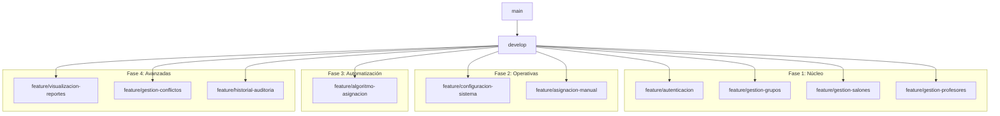

# Estrategia de Branching en Estructura de Árbol para Laravel - Sistema de Asignación de Salones

## Estructura Completa de Ramas del Proyecto

La estrategia de branching sigue un modelo de **Git Flow** adaptado a **Scrum con Kanban**, con ramas por épica (HU1-HU19) y fases de desarrollo, alineado con el backlog de producto y diagramas generados (casos de uso, secuencia, clases, ERD, relacional, físico, DFD). Prioriza mantenibilidad, TDD y DevOps (CI/CD con GitHub Actions).

- **main** (producción estable)
  - **develop** (integración continua)
    - **feature/autenticacion** (Épica 1: HU1-HU2)
      - **feature/HU1-gestion-usuarios** (CRUD usuarios con roles: Admin, Superadmin, Coord, Prof, Sec)
      - **feature/HU2-login-system** (Autenticación con hash bcrypt, secuencia por rol)
    - **feature/gestion-grupos** (Épica 2: HU3-HU4)
      - **feature/HU3-registro-grupos** (Registro grupos con validaciones CHECK)
      - **feature/HU4-edicion-grupos** (Edición con triggers auditoría)
    - **feature/gestion-salones** (Épica 3: HU5-HU6)
      - **feature/HU5-registro-salones** (Registro salones con FULLTEXT recursos)
      - **feature/HU6-disponibilidad-salones** (Disponibilidad con particiones por ubicación)
    - **feature/gestion-profesores** (Épica 4: HU7-HU8)
      - **feature/HU7-registro-profesores** (Registro con UNIQUE especialidad)
      - **feature/HU8-disponibilidad-profesores** (Disponibilidad con índices por especialidad)
    - **feature/configuracion-sistema** (Épica 10: HU19)
      - **feature/HU19-parametros-generales** (Config params with CHECK, triggers validación)
    - **feature/asignacion-manual** (Épica 6: HU11-HU12)
      - **feature/HU11-interfaz-visual** (Drag-and-drop, diagrama secuencia manual)
      - **feature/HU12-validacion-conflictos** (Detección realtime, triggers CONFLICTOS)
    - **feature/algoritmo-asignacion** (Épica 5: HU9-HU10)
      - **feature/HU9-algoritmo-automatico** (Algoritmo score, clases con método calcularScore)
      - **feature/HU10-parametros-algoritmo** (Prioridades from PARAMETRO)
    - **feature/visualizacion-reportes** (Épica 7: HU13-HU15)
      - **feature/HU13-horario-semestral** (Vista v_horario_semestral, DFD Nivel 1)
      - **feature/HU14-horario-profesores** (Vista v_horario_personal)
      - **feature/HU15-reportes-utilizacion** (Vista v_reporte_utilizacion, ERD relacional)
    - **feature/gestion-conflictos** (Épica 8: HU16-HU17)
      - **feature/HU16-notificacion-conflictos** (Triggers insert CONFLICTOS/SUGERENCIAS)
      - **feature/HU17-restricciones-recursos** (RESTRICCION with guards, modelo físico)
    - **feature/historial-auditoria** (Épica 9: HU18)
      - **feature/HU18-historial-cambios** (AUDITORIA with particiones by timestamp)
    - **feature/models-base** (Base para diagramas de clases)
      - **feature/migration-users** (Migration USUARIO with ENUM rol)
      - **feature/migration-grupos** (Migration GRUPO with CHECK)
      - **feature/migration-salones** (Migration SALON with FULLTEXT)
      - **feature/migration-profesores** (Migration PROFESOR with UNIQUE)
      - **feature/model-grupo** (Model with herencia Usuario)
      - **feature/model-salon** (Model with relaciones FK)
      - **feature/model-profesor** (Model with métodos disponibilidad)
    - **feature/controllers-base** (Base para API RESTful TH2)
      - **feature/controllers-auth** (Controllers for HU2 login)
      - **feature/controller-grupos** (Controllers for HU3-4)
      - **feature/controller-salones** (Controllers for HU5-6)
      - **feature/controller-profesores** (Controllers for HU7-8)
      - **feature/controller-asignaciones** (Controllers for HU9-12)
    - **feature/views-base** (Base for frontend)
      - **feature/views-auth** (Views for login HU2)
      - **feature/views-grupos** (Views for HU3-4)
      - **feature/views-salones** (Views for HU5-6)
      - **feature/views-dashboard** (Dashboard for HU13-15)
    - **feature/docker-setup** (DevOps: Docker for CI/CD)
      - **feature/docker-nginx** (Nginx for frontend)
      - **feature/docker-mysql** (MySQL with InnoDB, scripts SQL)
      - **feature/docker-php** (PHP/Laravel for backend)
      - **feature/docker-compose-develop** (Compose for dev, with DFD flows)
      - **feature/docker-compose-staging** (Staging for testing prototypes)
      - **feature/docker-compose-production** (Production with escalabilidad)
    - **feature/api-endpoints** (TH2: API RESTful)
      - **feature/api-auth** (Endpoints /login, /users HU1-2)
      - **feature/api-grupos** (Endpoints /grupos HU3-4)
      - **feature/api-salones** (Endpoints /salones HU5-6)
      - **feature/api-profesores** (Endpoints /profesores HU7-8)
      - **feature/api-asignaciones** (Endpoints /asignaciones HU9-12)
    - **feature/tests-coverage** (TDD: Pruebas por HU)
      - **feature/tests-auth** (Tests for HU2, secuencia login)
      - **feature/tests-grupos** (Tests for HU3-4, guards grupo)
      - **feature/tests-salones** (Tests for HU5-6, triggers salón)
      - **feature/tests-profesores** (Tests for HU7-8)
      - **feature/tests-asignaciones** (Tests for HU9-12, algoritmo score)
    - **feature/documentation** (Docs for backlog)
      - **feature/docs-api** (API docs with TH2 endpoints)
      - **feature/docs-usuario** (User manual for roles, casos de uso)
      - **feature/docs-tecnica** (Technical: Diagramas ERD, físico, DFD)
    - **release/v1.0.0** (Fase 1: Núcleo - Épicas 1-4)
    - **release/v1.1.0** (Fase 2: Operativas - Épica 6,10)
    - **release/v1.2.0** (Fase 3: Automatización - Épica 5)
    - **release/v2.0.0** (Fase 4: Avanzadas - Épicas 7-9)
    - **hotfix/login-security-issue** (Hotfix for HU2 auth)
    - **hotfix/database-connection-fix** (Hotfix for BD ERD)
    - **hotfix/performance-optimization** (Hotfix for modelo físico índices)
    - **bugfix/HU3-validation-error** (Bugfix for grupo validation)
    - **bugfix/HU5-capacity-calculation** (Bugfix for salón capacidad)
    - **bugfix/HU11-drag-drop-bug** (Bugfix for interfaz manual)
  - **staging** (Testing by CI/CD)
  - **production** (Despliegue final)

## Detalle por Fases de Desarrollo

### Fase 1: Núcleo del Sistema (Épicas 1-4)
- **main**
  - **develop**
    - **feature/autenticacion**
      - **feature/HU1-gestion-usuarios** (CRUD usuarios with roles, diagramas secuencia)
      - **feature/HU2-login-system** (Login with hash, DFD auth process)
    - **feature/gestion-grupos**
      - **feature/HU3-registro-grupos** (Registro with CHECK, ERD grupo)
      - **feature/HU4-edicion-grupos** (Edición with triggers)
    - **feature/gestion-salones**
      - **feature/HU5-registro-salones** (Registro with FULLTEXT, modelo físico)
      - **feature/HU6-disponibilidad-salones** (Disponibilidad with partitions)
    - **feature/gestion-profesores**
      - **feature/HU7-registro-profesores** (Registro with UNIQUE, clases profesor)
      - **feature/HU8-disponibilidad-profesores** (Disponibilidad with índices)
    - **feature/models-base**
      - **feature/migration-users** (Migration USUARIO ENUM rol)
      - **feature/migration-grupos** (Migration GRUPO CHECK)
      - **feature/migration-salones** (Migration SALON FULLTEXT)
      - **feature/migration-profesores** (Migration PROFESOR UNIQUE)
      - **feature/model-grupo** (Model with herencia Usuario, diagrama clases)
      - **feature/model-salon** (Model with relaciones FK)
      - **feature/model-profesor** (Model with métodos disponibilidad)
    - **release/v1.0.0** (Núcleo: Diagramas ERD base, DFD Nivel 0)

### Fase 2: Funcionalidades Operativas (Épicas 6,10)
- **main**
  - **develop**
    - **feature/configuracion-sistema**
      - **feature/HU19-parametros-generales** (Config PARAMETRO with CHECK, triggers)
    - **feature/asignacion-manual**
      - **feature/HU11-interfaz-visual** (Drag-and-drop, secuencia manual)
      - **feature/HU12-validacion-conflictos** (Detección RT, triggers ASIGNACION)
    - **feature/controllers-base** (API RESTful TH2)
      - **feature/controllers-auth** (Controllers HU2 login)
      - **feature/controller-grupos** (Controllers HU3-4)
      - **feature/controller-salones** (Controllers HU5-6)
      - **feature/controller-profesores** (Controllers HU7-8)
      - **feature/controller-asignaciones** (Controllers HU9-12)
    - **feature/views-base** (Frontend)
      - **feature/views-auth** (Views HU2)
      - **feature/views-grupos** (Views HU3-4)
      - **feature/views-salones** (Views HU5-6)
      - **feature/views-dashboard** (Dashboard HU13-15)
    - **release/v1.1.0** (Operativas: DFD Nivel 1, modelo relacional)

### Fase 3: Automatización y Algoritmos (Épica 5)
- **main**
  - **develop**
    - **feature/algoritmo-asignacion**
      - **feature/HU9-algoritmo-automatico** (Algoritmo score, clases calcularScore)
      - **feature/HU10-parametros-algoritmo** (Prioridades PARAMETRO)
    - **feature/api-endpoints** (TH2)
      - **feature/api-auth** (Endpoints /login HU2)
      - **feature/api-grupos** (Endpoints /grupos HU3-4)
      - **feature/api-salones** (Endpoints /salones HU5-6)
      - **feature/api-profesores** (Endpoints /profesores HU7-8)
      - **feature/api-asignaciones** (Endpoints /asignaciones HU9-12)
    - **feature/tests-coverage** (TDD)
      - **feature/tests-auth** (Tests HU2, secuencia)
      - **feature/tests-grupos** (Tests HU3-4)
      - **feature/tests-salones** (Tests HU5-6)
      - **feature/tests-profesores** (Tests HU7-8)
      - **feature/tests-asignaciones** (Tests HU9-12, algoritmo)
    - **release/v1.2.0** (Automatización: Diagrama clases, ERD relacional)

### Fase 4: Funcionalidades Avanzadas (Épicas 7-9)
- **main**
  - **develop**
    - **feature/visualizacion-reportes**
      - **feature/HU13-horario-semestral** (Vista v_horario_semestral)
      - **feature/HU14-horario-profesores** (Vista v_horario_personal)
      - **feature/HU15-reportes-utilizacion** (Vista v_reporte_utilizacion)
    - **feature/gestion-conflictos**
      - **feature/HU16-notificacion-conflictos** (Triggers CONFLICTOS, DFD Épica 8)
      - **feature/HU17-restricciones-recursos** (RESTRICCION with guards, modelo físico)
    - **feature/historial-auditoria**
      - **feature/HU18-historial-cambios** (AUDITORIA by timestamp, particiones)
    - **feature/documentation**
      - **feature/docs-api** (API docs TH2)
      - **feature/docs-usuario** (Manual roles, casos de uso)
      - **feature/docs-tecnica** (Diagramas ERD, físico, DFD)
    - **release/v2.0.0** (Avanzadas: DFD Nivel 1, modelo físico)

## Estructura de Ramas Técnicas Específicas

### Infraestructura y DevOps
- **main**
  - **develop**
    - **feature/docker-setup** (DevOps CI/CD)
      - **feature/docker-nginx** (Nginx frontend)
      - **feature/docker-mysql** (MySQL InnoDB, scripts SQL)
      - **feature/docker-php** (PHP/Laravel backend)
      - **feature/docker-compose-develop** (Compose dev, DFD flows)
      - **feature/docker-compose-staging** (Staging testing)
      - **feature/docker-compose-production** (Production escalabilidad)
    - **feature/ci-cd-pipeline** (GitHub Actions)
      - **feature/github-actions** (CI for TDD, linting)
      - **feature/tests-automation** (Tests HU, secuencia)
      - **feature/deployment-scripts** (Despliegue Render)
    - **feature/performance-optimization** (Modelo físico)
      - **feature/cache-implementation** (Cache for HU13-15)
      - **feature/database-optimization** (Índices/particiones)
      - **feature/frontend-optimization** (Responsive for usabilidad)
    - **feature/security-hardening** (Seguridad)
      - **feature/authentication-security** (Bcrypt HU2)
      - **feature/data-protection** (Auditoría HU18)
      - **feature/audit-logging** (Triggers AUDITORIA)

### Frontend y UX/UI
- **main**
  - **develop**
    - **feature/frontend-components**
      - **feature/ui-components** (Componentes for roles)
      - **feature/layout-system** (Layout dashboard)
      - **feature/responsive-design** (Responsive navegadores)
    - **feature/user-interface**
      - **feature/drag-drop-interface** (HU11 manual)
      - **feature/real-time-updates** (HU12 conflicts realtime)
      - **feature/conflict-visualization** (HU16 notificaciones)
    - **feature/user-experience**
      - **feature/loading-states** (Rendimiento <2s)
      - **feature/error-handling** (Guards en secuencia)
      - **feature/accessibility** (Accesible, usabilidad)
    - **feature/mobile-responsive**
      - **feature/tablet-optimization** (Responsive)
      - **feature/mobile-layout** (Móvil)

## Ramas de Soporte y Mantenimiento

### Hotfixes Críticos
- **main**
  - **develop**
    - **hotfix/login-security-issue** (HU2 auth)
    - **hotfix/database-connection-fix** (BD ERD)
    - **hotfix/performance-optimization** (Modelo físico índices)
    - **hotfix/memory-leak-fix** (Rendimiento)
    - **hotfix/security-patch** (Seguridad)
    - **hotfix/critical-bug-fix** (Bug general)

### Bugfixes por Funcionalidad
- **main**
  - **develop**
    - **bugfix/HU3-validation-error** (Grupo validation)
    - **bugfix/HU5-capacity-calculation** (Salón capacidad)
    - **bugfix/HU11-drag-drop-bug** (Interfaz manual)
    - **bugfix/HU13-timetable-display** (Horario semestral)
    - **bugfix/HU14-professor-schedule** (Horario personal)
    - **bugfix/HU15-report-generation** (Reportes)

### Ramas de Refactorización
- **main**
  - **develop**
    - **refactor/database-schema** (Modelo relacional)
    - **refactor/application-architecture** (Diagrama clases)
    - **refactor/code-organization** (Modularidad)
    - **refactor/performance-improvement** (Modelo físico)
    - **refactor/security-enhancement** (Seguridad)

## Comandos para Crear la Estructura Completa

```bash
#!/bin/bash
# scripts/create-complete-branch-structure.sh

echo "Creando estructura completa de ramas..."

# Rama principal
git checkout -b develop main

# Fase 1: Núcleo del Sistema
git checkout -b feature/autenticacion develop
git checkout -b feature/HU1-gestion-usuarios feature/autenticacion
git checkout -b feature/HU2-login-system feature/autenticacion

git checkout -b feature/gestion-grupos develop
git checkout -b feature/HU3-registro-grupos feature/gestion-grupos
git checkout -b feature/HU4-edicion-grupos feature/gestion-grupos

git checkout -b feature/gestion-salones develop
git checkout -b feature/HU5-registro-salones feature/gestion-salones
git checkout -b feature/HU6-disponibilidad-salones feature/gestion-salones

git checkout -b feature/gestion-profesores develop
git checkout -b feature/HU7-registro-profesores feature/gestion-profesores
git checkout -b feature/HU8-disponibilidad-profesores feature/gestion-profesores

# Fase 2: Funcionalidades Operativas
git checkout -b feature/configuracion-sistema develop
git checkout -b feature/HU19-parametros-generales feature/configuracion-sistema

git checkout -b feature/asignacion-manual develop
git checkout -b feature/HU11-interfaz-visual feature/asignacion-manual
git checkout -b feature/HU12-validacion-conflictos feature/asignacion-manual

# Fase 3: Automatización
git checkout -b feature/algoritmo-asignacion develop
git checkout -b feature/HU9-algoritmo-automatico feature/algoritmo-asignacion
git checkout -b feature/HU10-parametros-algoritmo feature/algoritmo-asignacion

# Fase 4: Avanzadas
git checkout -b feature/visualizacion-reportes develop
git checkout -b feature/HU13-horario-semestral feature/visualizacion-reportes
git checkout -b feature/HU14-horario-profesores feature/visualizacion-reportes
git checkout -b feature/HU15-reportes-utilizacion feature/visualizacion-reportes

git checkout -b feature/gestion-conflictos develop
git checkout -b feature/HU16-notificacion-conflictos feature/gestion-conflictos
git checkout -b feature/HU17-restricciones-recursos feature/gestion-conflictos

git checkout -b feature/historial-auditoria develop
git checkout -b feature/HU18-historial-cambios feature/historial-auditoria

echo "Estructura de ramas creada exitosamente!"
```

