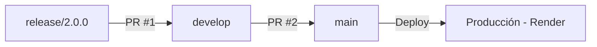

# Resumen Ejecutivo: Pull Requests Release 2.0.0

## 🎯 Objetivo

Este documento resume el proceso de integración de la versión 2.0.0 del Sistema de Asignación de Salones, detallando los Pull Requests necesarios para llevar los cambios desde `release/2.0.0` hasta producción (`main`), pasando por `develop`.

## 📋 Pull Requests Requeridos

### PR #1: release/2.0.0 → develop
**Propósito**: Integrar mejoras de infraestructura y CI/CD en la rama de desarrollo

**Descripción Completa**: [PR_Release_2.0.0_to_Develop.md](./PR_Release_2.0.0_to_Develop.md)

**Cambios Principales**:
- Dockerfile multi-servicio con Nginx y PHP-FPM
- GitHub Actions completamente funcional
- Configuración para Supabase y Render
- Health check endpoint
- Pre-commit hooks
- Optimizaciones de CI/CD

**Commits**: ~20 commits relacionados con infraestructura y DevOps

---

### PR #2: develop → main
**Propósito**: Publicar la versión completa 2.0.0 en producción

**Descripción Completa**: [PR_Develop_to_Main.md](./PR_Develop_to_Main.md)

**Cambios Principales**:
- ✅ 10 Épicas completadas (HU1-HU19)
- ✅ Sistema completo de gestión de recursos educativos
- ✅ Asignación automática y manual
- ✅ Visualización y reportes
- ✅ Auditoría completa
- ✅ Infraestructura DevOps

**Commits**: 100+ commits acumulados desde el inicio del desarrollo

---

## 🏗️ Arquitectura y Visión del Producto

### Arquitectura Modular Implementada

El sistema sigue una arquitectura modular con separación clara de responsabilidades:

```
Sistema de Asignación de Salones (MVC - Laravel)
│
├── Capa de Autenticación (Épica 1)
│   ├── Gestión de Usuarios
│   └── Sistema de Login por Roles
│
├── Capa de Gestión de Recursos (Épicas 2, 3, 4)
│   ├── Módulo de Grupos
│   ├── Módulo de Salones
│   └── Módulo de Profesores
│
├── Capa de Asignaciones (Épicas 5, 6)
│   ├── Motor de Asignación Automática
│   │   ├── Algoritmo de Scoring
│   │   └── Configuración de Parámetros
│   └── Interfaz de Asignación Manual
│       ├── Drag & Drop
│       └── Validación de Conflictos
│
├── Capa de Visualización (Épica 7)
│   ├── Horarios Semestrales
│   ├── Horarios Personales
│   └── Reportes de Utilización
│
├── Capa de Restricciones (Épica 8)
│   ├── Gestión de Conflictos
│   └── Sistema de Sugerencias
│
├── Capa de Auditoría (Épica 9)
│   └── Historial de Cambios
│
└── Capa de Configuración (Épica 10)
    └── Parámetros del Sistema
```

### Principios Aplicados

1. **Cohesión Alta**: Cada módulo tiene una responsabilidad única y bien definida
2. **Bajo Acoplamiento**: Módulos independientes con interfaces claras
3. **Mantenibilidad**: Código organizado siguiendo convenciones Laravel
4. **Escalabilidad**: Base de datos optimizada con índices y particiones
5. **Testabilidad**: TDD implementado con Pest

## 👥 Progresión por Roles

### Estrategia de Desarrollo Incremental

El desarrollo siguió un enfoque progresivo por roles, comenzando con funcionalidades simples y avanzando hacia las más complejas:

#### Fase 1: Rol Profesor (Base del Sistema)
**Objetivo**: Establecer funcionalidades fundamentales de consulta

**Funcionalidades Implementadas**:
- ✅ Visualizar horario personal
- ✅ Consultar asignaciones
- ✅ Ver disponibilidad horaria

**Módulos Base Desarrollados**:
- Autenticación (HU1, HU2)
- Gestión de Profesores (HU7, HU8)
- Visualización de Horarios (HU14)

**Beneficio**: Validación temprana de arquitectura con rol de menor complejidad

---

#### Fase 2: Rol Coordinador (Funcionalidad Completa)
**Objetivo**: Implementar herramientas de gestión y administración

**Funcionalidades Implementadas**:
- ✅ CRUD de grupos, salones y profesores
- ✅ Asignación automática con algoritmo
- ✅ Asignación manual con interfaz visual
- ✅ Visualización de horario semestral completo
- ✅ Generación de reportes
- ✅ Gestión de restricciones
- ✅ Configuración del sistema

**Módulos Coordinador**:
- Gestión de Recursos (HU3-HU8)
- Asignaciones (HU9-HU12)
- Reportes (HU13, HU15)
- Restricciones (HU16, HU17)
- Auditoría (HU18)
- Configuración (HU19)

**Beneficio**: Sistema completo de gestión operativa

---

#### Fase 3: Roles Especializados (Delegación)
**Objetivo**: Especialización de funciones

**Roles Implementados**:
- ✅ **Coordinador Académico**: Enfoque en grupos y profesores
- ✅ **Coordinador de Infraestructura**: Enfoque en salones
- ✅ **Secretaria Académica**: Consulta y reportes académicos
- ✅ **Secretaria de Infraestructura**: Consulta de espacios
- ✅ **Administrador**: Control total del sistema
- ✅ **Superadministrador**: Gestión de usuarios y configuración crítica

**Beneficio**: Asignación precisa de responsabilidades

---

### Ventajas de la Progresión por Rol

1. **Desarrollo Incremental**: Cada fase construye sobre la anterior
2. **Validación Temprana**: Errores detectados con rol simple (Profesor)
3. **Reducción de Riesgo**: Problemas encontrados antes de llegar a roles complejos
4. **Testing Progresivo**: Tests acumulativos garantizan estabilidad
5. **Aprendizaje del Equipo**: Curva de aprendizaje gradual

## 📚 Referencias a Documentación

### Visión del Producto

#### Análisis de Requerimientos
**Archivo**: [Analisis Levantamiento de Requerimientos.md](./Analisis%20Levantamiento%20de%20Requerimientos.md)

**Contenido**:
- Introducción al sistema
- Requerimientos funcionales (HU1-HU19)
- Requerimientos no funcionales (rendimiento, seguridad, usabilidad)
- Priorización de épicas
- Backlog de producto completo

#### Estrategia de Desarrollo
**Archivo**: [EstrategiaDeBranching.md](./EstrategiaDeBranching.md)

**Contenido**:
- Modelo de Git Flow adaptado
- Ramas por épica y fase
- Estructura completa de desarrollo
- Release v2.0.0 como Fase 4

### Diagramas Técnicos

#### Diagramas de Diseño
- **Casos de Uso**: [DiagramaCasosDeUsoGeneral.md](./DiagramaCasosDeUsoGeneral.md)
- **Secuencia**: [DiagramaSecuenciaCasosDeUso.md](./DiagramaSecuenciaCasosDeUso.md)
- **Clases**: [DiagramaDeClases.md](./DiagramaDeClases.md)
- **Flujo de Datos**: [DiagramaFlujoDatos.md](./DiagramaFlujoDatos.md)

#### Diagramas de Base de Datos
- **Entidad-Relación**: [DiagramaEntidadRelacion.md](./DiagramaEntidadRelacion.md)
- **Modelo Relacional**: [DiagramaModeloRelacional.md](./DiagramaModeloRelacional.md)
- **Modelo Físico**: [DiagramaModeloFisico.md](./DiagramaModeloFisico.md)

### Módulos por Rol

#### Documentación de Épicas
- **Épica 2**: [epica2/](./epica2/) - Gestión de Grupos
- **HU3**: [HU3.md](./HU3.md) - Registro de Grupos
- **HU4**: [HU4.md](./HU4.md) - Edición de Grupos

#### Funcionalidades por Rol

**Profesor**:
- Consulta de horarios (HU14)
- Visualización de asignaciones
- Acceso a información personal

**Coordinador**:
- Gestión completa de recursos (HU3-HU8)
- Asignaciones (HU9-HU12)
- Reportes (HU13-HU15)
- Restricciones (HU16-HU17)
- Auditoría (HU18)
- Configuración (HU19)

**Administrador/Superadministrador**:
- Gestión de usuarios (HU1)
- Configuración avanzada del sistema
- Control total de funcionalidades

## 🔄 Proceso de Integración

### Paso a Paso



### Cronología Recomendada

1. **Día 1**: Crear PR #1 (release/2.0.0 → develop)
2. **Día 1-2**: Review y testing del PR #1
3. **Día 2**: Merge PR #1
4. **Día 2**: Verificar que develop está estable
5. **Día 3**: Crear PR #2 (develop → main)
6. **Día 3-5**: Review exhaustivo del PR #2 por TODO el equipo
7. **Día 5**: Aprobación del Product Owner
8. **Día 5**: Merge PR #2
9. **Día 5-6**: Despliegue a producción y monitoreo

### Checkpoints Importantes

- ✅ Tests pasando en CI/CD
- ✅ No hay conflictos de merge
- ✅ Documentación actualizada
- ✅ Product Owner ha aprobado
- ✅ Equipo completo ha revisado
- ✅ Health check funcional en producción

## 📊 Métricas del Release

### Desarrollo
- **Épicas**: 10/10 (100%)
- **Historias de Usuario**: 19/19 (100%)
- **Historias Técnicas**: 4/4 (100%)
- **Pull Requests**: 110+
- **Commits**: 100+

### Calidad
- **Cobertura de Tests**: Alta
- **CI/CD**: 100% funcional
- **Code Reviews**: Todos los PRs revisados
- **Pre-commit Hooks**: Activos

### Infraestructura
- **Docker**: Configurado y optimizado
- **GitHub Actions**: Workflow completo
- **Render**: Configurado para despliegue
- **Supabase**: Base de datos producción

## 🎯 Criterios de Éxito

### Técnicos
- [x] Todos los tests pasan
- [x] CI/CD funcional
- [x] Sin vulnerabilidades de seguridad
- [x] Rendimiento < 2 segundos por operación
- [x] Base de datos optimizada

### Funcionales
- [x] Todas las HU implementadas
- [x] Todos los roles funcionando
- [x] Reportes generándose correctamente
- [x] Auditoría registrando cambios

### Negocio
- [x] Cumple con la visión del producto
- [x] Sigue la arquitectura modular
- [x] Progresión por rol implementada
- [x] Documentación completa

## 📞 Equipo Responsable

- **Product Owner**: Luis Carlos Pedraza
- **Scrum Master**: Luis Carlos Pedraza
- **Developers**: 
  - Luis Carlos Pedraza
  - Johan Alejandro Rodríguez
  - Kevin Andrés Galeano
  - Katherin Acevedo

## 📖 Documentos Relacionados

1. **Descripción PR #1**: [PR_Release_2.0.0_to_Develop.md](./PR_Release_2.0.0_to_Develop.md)
2. **Descripción PR #2**: [PR_Develop_to_Main.md](./PR_Develop_to_Main.md)
3. **Guía de Creación**: [GUIA_CREACION_PRS.md](./GUIA_CREACION_PRS.md)
4. **README Principal**: [../README.md](../README.md)

## 🎉 Conclusión

La versión 2.0.0 del Sistema de Asignación de Salones representa:

- ✅ **10 épicas completas** con funcionalidad end-to-end
- ✅ **Arquitectura modular** siguiendo mejores prácticas
- ✅ **Progresión por rol** desde Profesor hasta Administrador
- ✅ **Infraestructura DevOps** robusta y automatizada
- ✅ **Metodologías ágiles** aplicadas consistentemente
- ✅ **Documentación exhaustiva** de todos los aspectos

El sistema está **listo para producción** y preparado para servir a instituciones educativas en la optimización de sus procesos de asignación de recursos.

---

**Versión**: 2.0.0  
**Fecha**: Diciembre 2025  
**Estado**: ✅ Listo para Integración y Despliegue
