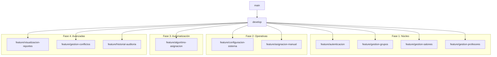

# Estrategia de Branching en Estructura de Árbol para Laravel

## Estructura Completa de Ramas del Proyecto

- **main**
  - **develop**
    - **feature/autenticacion**
      - **feature/HU1-gestion-usuarios**
      - **feature/HU2-login-system**
    - **feature/gestion-grupos**
      - **feature/HU3-registro-grupos**
      - **feature/HU4-edicion-grupos**
    - **feature/gestion-salones**
      - **feature/HU5-registro-salones**
      - **feature/HU6-disponibilidad-salones**
    - **feature/gestion-profesores**
      - **feature/HU7-registro-profesores**
      - **feature/HU8-disponibilidad-profesores**
    - **feature/configuracion-sistema**
      - **feature/HU19-parametros-generales**
    - **feature/asignacion-manual**
      - **feature/HU11-interfaz-visual**
      - **feature/HU12-validacion-conflictos**
    - **feature/algoritmo-asignacion**
      - **feature/HU9-algoritmo-automatico**
      - **feature/HU10-parametros-algoritmo**
    - **feature/visualizacion-reportes**
      - **feature/HU13-horario-semestral**
      - **feature/HU14-horario-profesores**
      - **feature/HU15-reportes-utilizacion**
    - **feature/gestion-conflictos**
      - **feature/HU16-notificacion-conflictos**
      - **feature/HU17-restricciones-recursos**
    - **feature/historial-auditoria**
      - **feature/HU18-historial-cambios**
    - **feature/models-base**
      - **feature/migration-users**
      - **feature/migration-grupos**
      - **feature/migration-salones**
      - **feature/migration-profesores**
      - **feature/model-grupo**
      - **feature/model-salon**
      - **feature/model-profesor**
    - **feature/controllers-base**
      - **feature/controllers-auth**
      - **feature/controller-grupos**
      - **feature/controller-salones**
      - **feature/controller-profesores**
      - **feature/controller-asignaciones**
    - **feature/views-base**
      - **feature/views-auth**
      - **feature/views-grupos**
      - **feature/views-salones**
      - **feature/views-dashboard**
    - **feature/docker-setup**
      - **feature/docker-nginx**
      - **feature/docker-mysql**
      - **feature/docker-php**
      - **feature/docker-compose-develop**
      - **feature/docker-compose-staging**
      - **feature/docker-compose-production**
    - **feature/api-endpoints**
      - **feature/api-auth**
      - **feature/api-grupos**
      - **feature/api-salones**
      - **feature/api-profesores**
      - **feature/api-asignaciones**
    - **feature/tests-coverage**
      - **feature/tests-auth**
      - **feature/tests-grupos**
      - **feature/tests-salones**
      - **feature/tests-profesores**
      - **feature/tests-asignaciones**
    - **feature/documentation**
      - **feature/docs-api**
      - **feature/docs-usuario**
      - **feature/docs-tecnica**
    - **release/v1.0.0**
    - **release/v1.1.0**
    - **release/v1.2.0**
    - **release/v2.0.0**
    - **hotfix/login-security-issue**
    - **hotfix/database-connection-fix**
    - **hotfix/performance-optimization**
    - **bugfix/HU3-validation-error**
    - **bugfix/HU5-capacity-calculation**
    - **bugfix/HU11-drag-drop-bug**
  - **staging**
  - **production**

# Detalle por Fases de Desarrollo

## Fase 1: Núcleo del Sistema

- **main**
  - **develop**
    - **feature/autenticacion**
      - **feature/HU1-gestion-usuarios**
      - **feature/HU2-login-system**
    - **feature/gestion-grupos**
      - **feature/HU3-registro-grupos**
      - **feature/HU4-edicion-grupos**
    - **feature/gestion-salones**
      - **feature/HU5-registro-salones**
      - **feature/HU6-disponibilidad-salones**
    - **feature/gestion-profesores**
      - **feature/HU7-registro-profesores**
      - **feature/HU8-disponibilidad-profesores**
    - **feature/models-base**
      - **feature/migration-users**
      - **feature/migration-grupos**
      - **feature/migration-salones**
      - **feature/migration-profesores**
      - **feature/model-grupo**
      - **feature/model-salon**
      - **feature/model-profesor**
    - **release/v1.0.0**

## Fase 2: Funcionalidades Operativas

- **main**
  - **develop**
    - **feature/configuracion-sistema**
      - **feature/HU19-parametros-generales**
    - **feature/asignacion-manual**
      - **feature/HU11-interfaz-visual**
      - **feature/HU12-validacion-conflictos**
    - **feature/controllers-base**
      - **feature/controllers-auth**
      - **feature/controller-grupos**
      - **feature/controller-salones**
      - **feature/controller-profesores**
      - **feature/controller-asignaciones**
    - **feature/views-base**
      - **feature/views-auth**
      - **feature/views-grupos**
      - **feature/views-salones**
      - **feature/views-dashboard**
    - **release/v1.1.0**

## Fase 3: Automatización y Algoritmos

- **main**
  - **develop**
    - **feature/algoritmo-asignacion**
      - **feature/HU9-algoritmo-automatico**
      - **feature/HU10-parametros-algoritmo**
    - **feature/api-endpoints**
      - **feature/api-auth**
      - **feature/api-grupos**
      - **feature/api-salones**
      - **feature/api-profesores**
      - **feature/api-asignaciones**
    - **feature/tests-coverage**
      - **feature/tests-auth**
      - **feature/tests-grupos**
      - **feature/tests-salones**
      - **feature/tests-profesores**
      - **feature/tests-asignaciones**
    - **release/v1.2.0**

## Fase 4: Funcionalidades Avanzadas

- **main**
  - **develop**
    - **feature/visualizacion-reportes**
      - **feature/HU13-horario-semestral**
      - **feature/HU14-horario-profesores**
      - **feature/HU15-reportes-utilizacion**
    - **feature/gestion-conflictos**
      - **feature/HU16-notificacion-conflictos**
      - **feature/HU17-restricciones-recursos**
    - **feature/historial-auditoria**
      - **feature/HU18-historial-cambios**
    - **feature/documentation**
      - **feature/docs-api**
      - **feature/docs-usuario**
      - **feature/docs-tecnica**
    - **release/v2.0.0**

## Estructura de Ramas Técnicas Específicas

### Infraestructura y DevOps

- **main**
  - **develop**
    - **feature/docker-setup**
      - **feature/docker-nginx**
      - **feature/docker-mysql**
      - **feature/docker-php**
      - **feature/docker-compose-develop**
      - **feature/docker-compose-staging**
      - **feature/docker-compose-production**
    - **feature/ci-cd-pipeline**
      - **feature/github-actions**
      - **feature/tests-automation**
      - **feature/deployment-scripts**
    - **feature/performance-optimization**
      - **feature/cache-implementation**
      - **feature/database-optimization**
      - **feature/frontend-optimization**
    - **feature/security-hardening**
      - **feature/authentication-security**
      - **feature/data-protection**
      - **feature/audit-logging**

### Frontend y UX/UI

- **main**
  - **develop**
    - **feature/frontend-components**
      - **feature/ui-components**
      - **feature/layout-system**
      - **feature/responsive-design**
    - **feature/user-interface**
      - **feature/drag-drop-interface**
      - **feature/real-time-updates**
      - **feature/conflict-visualization**
    - **feature/user-experience**
      - **feature/loading-states**
      - **feature/error-handling**
      - **feature/accessibility**
    - **feature/mobile-responsive**
      - **feature/tablet-optimization**
      - **feature/mobile-layout**

## Ramas de Soporte y Mantenimiento

### Hotfixes Críticos

- **main**
  - **develop**
    - **hotfix/login-security-issue**
    - **hotfix/database-connection-fix**
    - **hotfix/performance-optimization**
    - **hotfix/memory-leak-fix**
    - **hotfix/security-patch**
    - **hotfix/critical-bug-fix**

### Bugfixes por Funcionalidad

- **main**
  - **develop**
    - **bugfix/HU3-validation-error**
    - **bugfix/HU5-capacity-calculation**
    - **bugfix/HU11-drag-drop-bug**
    - **bugfix/HU13-timetable-display**
    - **bugfix/HU14-professor-schedule**
    - **bugfix/HU15-report-generation**

### Ramas de Refactorización

- **main**
  - **develop**
    - **refactor/database-schema**
    - **refactor/application-architecture**
    - **refactor/code-organization**
    - **refactor/performance-improvement**
    - **refactor/security-enhancement**

## Comandos para Crear la Estructura Completa

```bash
#!/bin/bash
# scripts/create-complete-branch-structure.sh

echo "Creando estructura completa de ramas..."

# Rama principal
git checkout -b develop main

# Fase 1: Núcleo del Sistema
git checkout -b feature/autenticacion develop
git checkout -b feature/HU1-gestion-usuarios feature/autenticacion
git checkout -b feature/HU2-login-system feature/autenticacion

git checkout -b feature/gestion-grupos develop
git checkout -b feature/HU3-registro-grupos feature/gestion-grupos
git checkout -b feature/HU4-edicion-grupos feature/gestion-grupos

git checkout -b feature/gestion-salones develop
git checkout -b feature/HU5-registro-salones feature/gestion-salones
git checkout -b feature/HU6-disponibilidad-salones feature/gestion-salones

git checkout -b feature/gestion-profesores develop
git checkout -b feature/HU7-registro-profesores feature/gestion-profesores
git checkout -b feature/HU8-disponibilidad-profesores feature/gestion-profesores

# Fase 2: Funcionalidades Operativas
git checkout -b feature/configuracion-sistema develop
git checkout -b feature/HU19-parametros-generales feature/configuracion-sistema

git checkout -b feature/asignacion-manual develop
git checkout -b feature/HU11-interfaz-visual feature/asignacion-manual
git checkout -b feature/HU12-validacion-conflictos feature/asignacion-manual

# Fase 3: Automatización
git checkout -b feature/algoritmo-asignacion develop
git checkout -b feature/HU9-algoritmo-automatico feature/algoritmo-asignacion
git checkout -b feature/HU10-parametros-algoritmo feature/algoritmo-asignacion

# Fase 4: Avanzadas
git checkout -b feature/visualizacion-reportes develop
git checkout -b feature/HU13-horario-semestral feature/visualizacion-reportes
git checkout -b feature/HU14-horario-profesores feature/visualizacion-reportes
git checkout -b feature/HU15-reportes-utilizacion feature/visualizacion-reportes

git checkout -b feature/gestion-conflictos develop
git checkout -b feature/HU16-notificacion-conflictos feature/gestion-conflictos
git checkout -b feature/HU17-restricciones-recursos feature/gestion-conflictos

git checkout -b feature/historial-auditoria develop
git checkout -b feature/HU18-historial-cambios feature/historial-auditoria

echo "Estructura de ramas creada exitosamente!"

```
---

# Flujo de Trabajo Visual por Fases



---

- Esta estructura de árbol proporciona una visión clara y organizada de todas las ramas del proyecto, agrupadas lógicamente por fases de desarrollo y funcionalidades, manteniendo la coherencia con el stack tecnológico Laravel + MySQL + Docker.
